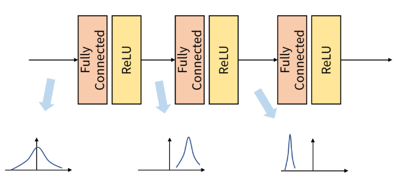
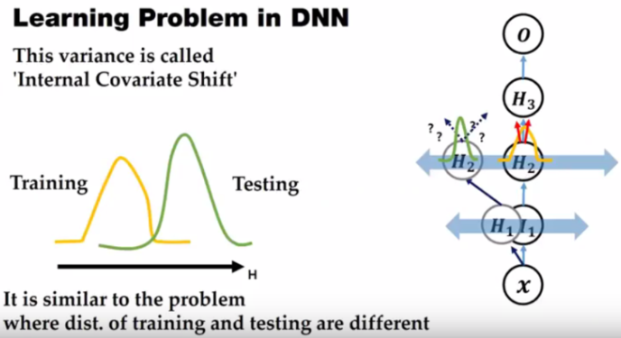
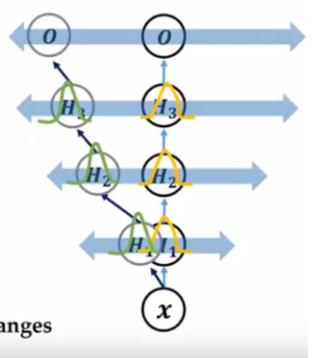
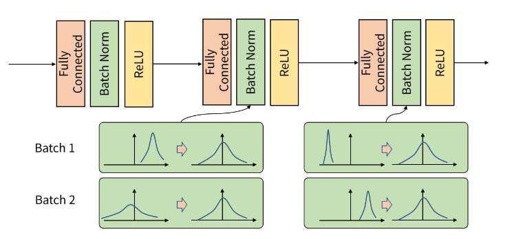
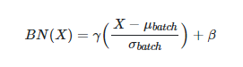
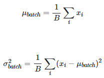
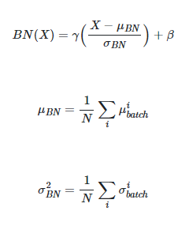

### Batch Normalization 

---

- `Batch normalization & Internal Covariance shift & Normalization / Whitening`

      * Internal Covariance Shift 

      Internal Covariance Shift는 Neural network의 각 계층 별로 입력되는 데이터의 분포가 달라지는 현상을 말한다.
      데이터들은 Network의 각 layer를 통과하면서 convolution, pooling, activation function 등등의 함수를 거친다.

        -> 이렇게 되면 처음 입력되는 데이터가 가지고 있던 분포와 각 연산을 거쳐 나온 출력 feature의 분포가 달라질 수 있다. 
        -> 각 layer에서도 입력되는 데이터 feature의 분포가 계속 변화하게 되면 학습하는데에 어려움이 있다.  

이 문제는 hidden layer의 깊이가 깊어질수록 변화가 누적되어 feature 분포의 변화가 더 심해지게 된다. 

 
    
        * Batch normalization  (https://gaussian37.github.io/dl-concept-batchnorm/)
        
          Gradient 기반 학습 과정에서 Gradiet Descent 방법보다는 Stochastic Gradient Descent 또는 Batch Gradient Descent 방법을 더 많이 사용한다.
          SGD, BGD 모두 GD의 unbiased estimation 이기에 동일한 결과를 가져옴과 동시에 연산 효율성을 높여주고, gradient data의 correlation도 줄이는 효과가 있다.
        
            -> 하지만 Batch 단위로 학습을 하게 되면 Internal Corvariance Shift 문제가 발생한다.
        
          Batch normalization은 학습 과정에서 각 배치 단위 별로 데이터가 다양한 분포를 가지더라도, 각 배치별로 평균과 분산을 이용해 정규화하는 것이다.
          아래의 그림을 보면, batch에 따라서, layer에 따라서 입력되는 data, feature들의 분포가 모두 다르지만, 정규화를 통해 분포를 Zero mean gaussian 형태로 만든다. 

       

        주의할 점은 Neural network 학습 단계와 추론 단계에서 조금 다르게 적용되야한다는 것

        * 학습 단계에서의 Batch Normalization

            학습 단계에서 모든 feature에 정규화를 해주게 되면, feature들이 동일한 scale이 되어 learning rate 결정에 유리해진다. 
             
                -> feature 들의 scale이 다르면, gradient를 계산했을 때의 gradient의 scale 또한 다르다.
                   즉, 같은 learning rate에 대해 weight 마다 반응하는 정도가 달라진다.  

 

여기서 γ 는 스케일링 역할을 하고 β는 bias. γ, β 모두 backpropagation을 통해 학습한다.  

        * 추론 단계에서의 Batch Normalization

            추론 단계에서는 학습 과정에서의 평균을 average해서 사용한다. 
            또한 사용되는 γ, β 모두 학습 과정에서 학습했던 파라미터이다. 
            

        

