### DPG (Deterministic Policy Gradient) `2014`

---

- `DPG`  

        High Dimensional action space에 적용할 수 있다.

            - stochastic policy gradient의 limited case라고 볼 수 있고, 이를 논문에서 증명해준다.
              따라서 기존 SPG에 사용하던 기법들이나 Converge 조건들을 DPG에 그대로 적용할 수 있다.  

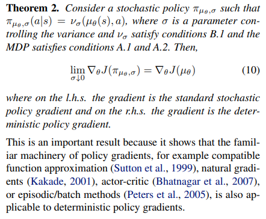

 

---

- `DPG vs SPG in Computational view`

        SPG가 state, action space 모두에 대해 적분을 수행하는 것에 비해 DPG는 action space에 대해서만 적분을 수행한다.

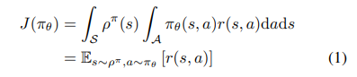
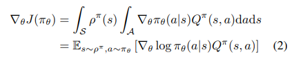

`SPG`

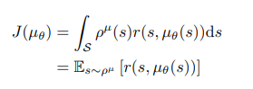
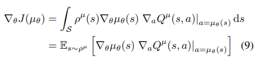

`DPG`

 

---
- `Compatible function approximation`
  
        Prof.Sutton의 PG paper에서 우리는 Objective function의 gradient의 true value인 Qπ 항을 모르기 때문에 이를 Gt 또는 Function Approximating Qw으로 대체한다.

        Qπ -> Gt : REINFORCE
        Qπ -> Qw : Actor Critic ------  하지만, 이 과정에서 bias가 발생하게 된다.

          - Qw는 Qπ의 추정이기 때문에, 추정값이 포함된 Objective functon의 gradient의 sample을 아무리 뽑아서 평균을 내도 biased gradient가 된다.
          - 이러한 bias로 인해, 전체적인 object function gradient의 방향이나 값이 변할 수 있다. 
            
                - 즉, gradient update가 stable하지 않고, convergence도 보장하지 못한다. 

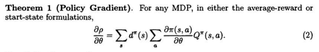

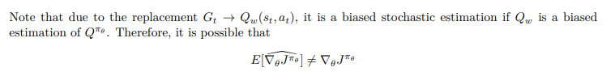

 

      하지만 Qw가 compatible function approximation condition을 만족한다면?
      
          1. Policy gradient의 방향이나 값에 영향을 주지않는다.
          2. 추정치를 포함했음에도 Bias가 없다. 

          ** Proof -> DPG paper 참고 

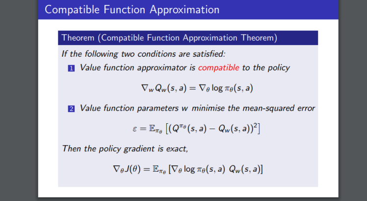

`compatible function approximation in SPG`

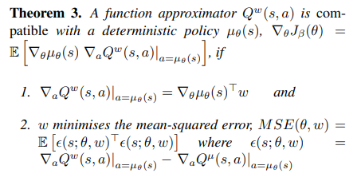

`compatible function approximation in DPG`

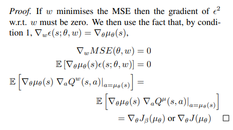

 

---

- `Exploration`

      SPG에 비해 DPG는 action space의 exploration이 상대적으로 부족하다.
      논문에서는 이를 보강하기 위해 Off policy 방법을 사용한다.

      Off policy를 사용하면, 우리가 원하는 Qπ가 아니라 Qβ가 얻어진다. (unbiased estimation인 Gt는 Qβ의 추정값) 
      즉, REINFORCE 방법 대신 A2C 방법을 사용해야 한다.  

Off policy Actor Critic

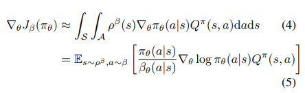

`Stochastic Policy의 경우 Actor와 Critic 모두 important sampling ratio를 곱해준다.` 

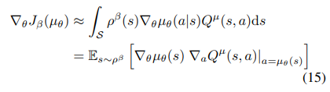
      
`Determinisitic Policy의 경우 Actor는 deterministic하기에, Critic은 Q learning을 쓰기에 ratio가 필요없다.`

      -> Off policy + TD + linear FA = may diverge
    -> Off policy + GTD + linear FA = Converge

