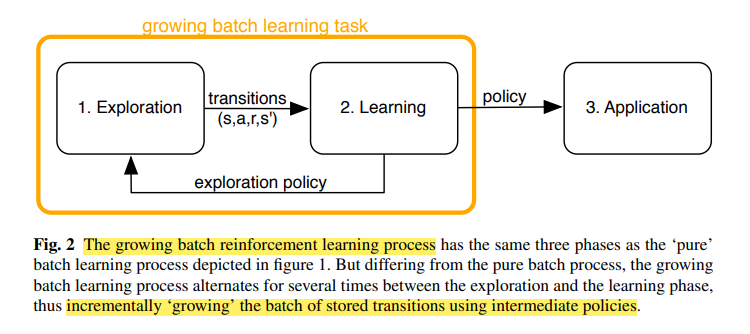
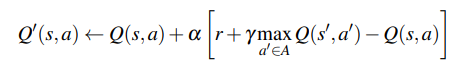
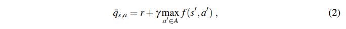
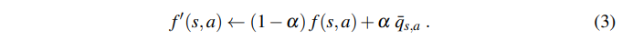
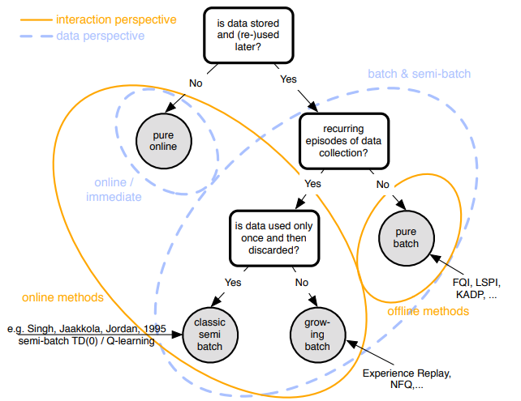
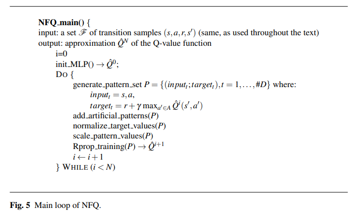

### Batch Reinforcement Learning [2012] 

---
        
    # 1 pure batch RL

        Unknown policy에 의해 구해져있는 fixed dataset 으로부터 policy를 학습

        특정 task에 대한 optimal policy를 찾는 Original RL의 목적이 batch RL에서는 달라진다고 한다.

            : Optimal policy 찾기 -> 주어진 데이터셋에 대한 Best policy 찾기  
            

    # pure batch RL의 문제 

        1. Distribution Shift
        2. Space Covering issue
            - Given dataset에 goal에 관한 state/action이 없다면 절대 optimal policy 찾을 수 없다.

---

    # 2 growing batch RL

        pure batch RL과 다르게 batch size가 점점 커진다.

        주어진 fixed dataset에 대해 학습하고, exploration을 통해 batch size를 키운다.

            - 이 부분에서 더 이상의 pure Batch RL의 모습이 아니게 된다. 
            - 약간 Original RL과 비슷한 모습을 보이므로 Online vs Offline 이렇게 나눠서 Batch RL을 식별하기 힘들다.
            - 따라서 어떤 알고리즘을 쓰는지, update rule은 어떤지에 따라 구분하자고 한다.

        ChatGPT에 따르면, growing batch RL의 motivation은 distributional shift 라고 한다. 

    # Distributional Shift (a.k.a covariate shift)

        Distribution Shift는 training에 사용된 data 분포 != test에서 마주치는 data 분포 인 상황을 의미.

            - tranining data가 target distribution을 제대로 표현하지 못한다면, policy가 suboptimal로 갈 수 있다.

            distributional shift는 여러가지 이유로 발생할 수 있다.

                1. Changes in the environment
                2. Changes in the policy of the agent 
                3. Errors in data collection or preprocessing

        이 shift는 큰 문제가 될 수 있다.

            tranining data가 target distribution을 정확히 표현한다는 가정하에 
            Agent의 policy / value function이 최적화되어있기 때문. 

----

    # 3 Foundation of RL Algorithms 

        Q Learning : small, discrete space에서는 good.. large, continuouse? bad..
        
        `Model-free online learning` 문제의 경우 3개 정도의 독립적인 문제가 있다.

        1. Exploration overhead : 느린 학습 유발
        2. stochastic approximation에 의한 비효율성
        3. function approximation의 사용 : 안정성 문제 유발 

        modern batch RL 알고리즘은 위 세 가지 factor 들을 해결하려고 한다.

    # 3-1 : `Experience Replay` for addressing the Exploration Overhead

        online learning의 대표격인 위 Q-Learning의 update rule을 보면, 
        한 번 update한 후 experienced transition을 버린다. (forget)

        
        이 접근법이 수렴한다는 건 보장이 되지만, transition을 따라 local하게 update하고 transition을 버리는건 심각한 성능 문제가 있다.

            # experience overhead in online learning 

            Q(st,at) 업데이트하면, Q(st-1, -) 값들에 영향을 주게 된다. (ok)

            근데 이 변화가 바로 back-propagate되지 않는다..! 

            st-1 state들이 다음에 방문될 때, 그제서야 이 변화가 적용된다...ㅠㅠ

            또, 재귀적으로 st-2 state들은 그 다음 trial에 변화가 적용된다..

        이 문제는 이미 우리가 얻은 정보를 trajectory를 따른 reverse order로 whole state space에 퍼트리는 것에 대한 문제이고, 

        이게 성능 하락을 가져온다. (st -> st-1 -> st-2 -> st-3 -> ...)
            

        이 문제는 같은 trajectory를 다시 sweep할 확률이 적은, 실제 환경에서 더 큰 문제를 일으킨다. 
        (반영되야할 정보의 spread가 즉각적으로 되지 않는다.)

        이에 대한 해결방법은 1992년 Lin이 `experience replay`를 도입 !

        Experience replay를 사용하면, Q(st, at)에 이르기까지의 모든 transition을 저장해둔다.

        [Q(st-3, at-3), Q(st-2, at-2), Q(st-1, at-1), Q(st, at), ...]        

        그리고 시스템과의 interaction을 진행하면서, 저장된 transition들을 뽑아 update한다.

        이 방법은 trajectory를 따라 순차적으로 update하고 transition을 버리지 않기 때문에 (online learning) 

        st의 선행 state 들에 대해서도 정보 spreading이 자연스레 가능해진다..! 
    
        By spreading this information along these connections, ideallly, speeding up convergence.

---

`Dynamic Programming Step`

`Function Approxmiation Step`

        # 3-2 : The idea of 'Fitting' to address stability issue

        Online RL은 주로 Asynchronous update이다.

            # Asynchronous update

                : 한 state-action pair Q(s, a)에 대해서 update하고 다른 state, action pair에 대해서는 값이 그대로
                    -> table case를 생각해보면, Q(s, a)만 값이 업데이트 후 overwriting됨.

        Function Approximation도 동일하게 Asynchronous update 가 적용
        (그림 1, 2를 보면 Q learning update rule의 변형일 뿐, 같다)

        여기서 중요한 것은, 
        Q learning update나 Function approximation을 이용한 update나 특정 조합일 때 불안정하고 발산한다는 것!
            - 이 조합들에 대해서는 engineer가 개고생하면서 경험적으로 찾아오고 있었는데, 하다보니 몇 가지 공통점이 있었다.

        1. Interdependancy of errors made in function approximation
        2. Deviations between the estimated value fuction and true value function 

        여기서 Approximation error는 propagation될 여지가 있기 때문에 생각보다 중요하다.

        DP update (2)는 Q와 true value Q* 사이의 차이를 gradually 줄이려 한다.
        근데, (3)에서 function approximator에 값을 저장할 때, 더 큰 error를 넣을 수 있다.
        
        이 Error는 이후로 이어지는 DP updates에 영향을 주고, 
        Contraction 과 반대되는 방향으로 갈수도, 심지어 prevnet 할 수도 있다.

        * 이 function approximation이 global function approximation일 때 더~~ 심각한 문제가 생긴다.
            (ex. neural network)

            - 하나의 error가 weight 조정을 통해 all state-action pair에 영향을 줄 수 있기 때문. 
        

        Gordon은 이 문제를 DP step (2)와 function approximation step (3)을 분리하는 방법으로 해결해보고자 한다.
        
        Idea : 

                1, 먼저, 모든 state-action pair에 DP update를 적용해서 
                    모든 state-action pair에 대한 target value를 계산한다. like (2)

                2. function approximator가 이 target value를 학습하도록 한다. (supervised learning)
                    아마도 MSE of |Q* - f|^2 이런식으로 .. -> (3) step 대체  
                    
                이렇게 되면 synchronously update가 진행된다. (All state-action pair에 대해 동시에 update)

                * 자세한 내용은 paper 참고 (stable function approximation in dynamic programming, 1995)

---

        # 3-3 : Replacing Inefficient Stochastic Approximation (-이해 부족)

            위 fitting idea를 model-based -> model-free로 확장시키려고 한다.
            
            이에 대한 방법으로 value function을 approximation하기 위해 states space에서 무작위로 supports를 선택하지 말고,
            그 value function을 direct하게 근사하는데에 sampled transition을 쓰자는 것이다. 
            (kernel-based approximator 이용)

            이 방법은 관측된 transition에 있는 각 state-action pair의 value 추정값을 계산하고, 
            후속 state들의 값은 근처 transition의 값들의 평균으로 estimate하자는 것이다. 
            
            Q learning은 한 state를 update하게 될 때 그 state를 여러번 방문하며 업데이트 해야한다.
            하지만 model-based에서는 한 번 업데이트이면 충분했다.

            위 방법을 쓰면, stochastic approximation에 의존하지 않고, 
            관측된 transition들을 평균을 취함으로써 transition model을 implicit하게 추정한다. 
                    

---

        # 4 Batch RL algorithms

            1. Kernel-based approximate dynamic programming (KADP) (-이해 부족) 

                experience replay 
                + fitting(seperation of (2) and (3)) 
                + kernel based self-approximation(sample-based)

            2. Fitted Q Iteration (FQI)

                The most popular algorithm in batch RL.
                (Q-Learning in Batch RL)

                
            3. Least Square Policy Iteration (LSPI)

                위 두 가지 방법과 다르게, explicitly policy iteration framework를 따른다.
                
                *policy iteration : policy evaluation + policy improvement 

                Policy evaluation  : Least-squares temporal difference learning
                Policy improvement : greedy policy 

---

        # 5 Identifying batch algorithms

        
            # online method 
            pure online   : Q learning

            # offline method 
            pure batch    : FQI, LSPI, KADP

            # in-between
            grwoing batch : NFQ(experience replay)

---

        # 6 Neural Fitted Q Iteration

            높은 정확도 + 적은 training sample로 generalize를 잘하는 능력 덕분에 
            Neural network ? value function을 표현하는 분야의 star가 됬다!

            Online RL에서.. current update는 지금까지 해온 업데이트들에 예측할 수 없는 영향을 준다.
                (전체적인 Weight가 바뀌잖아)
            
            하지만 Batch RL에서는 여태까지 확인한 모든 transition들에 대한 value function을 모두 동시에 업데이트한다.
            그래서 이전에 들인 공을 무너뜨리는 영향을 줄일 수 있다. 
            
                -> NFQ의 motivation 

            all training instance들을 동시에 update할 수 있다는 점은 batch supervised learning의 적용을 가능케 했다.
            특히 NFQ framwork에서 핵심 fitting step으로 adaptive supervised learning 알고리즘인 Rprop이 사용된다. 

        
            
            

        

        
        
