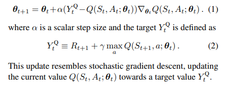
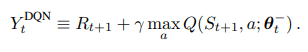
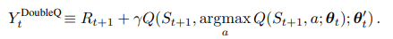

### Double DQN `2015`

---

- `Overestimation error`

            Q Learning은 Q value를 overestimation하는 문제를 가지고 있다.
            따라서, Q learning을 기반으로 FA를 업데이트 하는 DQN 또한 이러한 에러를 품고 있다.

                J(w) = E[ (R + r*maxQ(s', .) - Q(s,a))**2 ]
                w = w - a*∇J(w)
   

- `Maximization bias`

        <Prof.lee lecture 3 P55.>

        예를 들어 다음을 생각해보자 

        A = 1 + uniform{-5, 5} ------  따라서, E[A] = 1
        B = 2

            max { E[A1], E[A2], E[A3], E[A4], E[A5], E[B] } = max { 1, 1, 1, 1, 1, 2 } = 2 

        하지만 Expectation이 없는 상황에서는 ...

            max { A1, A2, A3, A4, A5, B } = 6 --- 이 값이 나올 확률이 꽤 크다.  

  
        이 현상이 Q-Learning에서도 똑같이 발생한다...

- `Maximization bias in Q Learning`

        *Q Learning update

            Q(s, a) = Q(s, a) + a*(R + r*maxQ(s', .) - Q(s, a))

        문제는 maxQ(s', a') 항에서 발생한다. Q는 어떠한 값이 아니라 추정치이다. 

            Q(s, a) = E[Gt | S = s, A = a]

        예를 들어 Action = (a1, a2, a3)가 있고 max 연산을 취할 때 다음과 같다 .

            maxQ(s, .) = max{Q(s, a1), Q(s, a2), Q(s, a3)} 
        
        여기서 가장 큰 값인 Q(s, a1)을 골랐다고 가정할 때, 여기서 문제가 발생한다.
        Q(s, a1)은 실제 평균 값이 아니라, 추정치이다.

            -> Q(s, a1), Q(s, a2), Q(s, a3) 들의 실제 평균값인 m1, m2, m3 를 비교해서 max 연산을 했다면 문제가 없다.
            -> 하지만 추정치 끼리 max 연산을 했기 때문에 항상 값이 크게 추정될 수 밖에 없다. 
                -> bias가 생기고, convergence가 느려진다. 
         

---

- `Double DQN`

            
            *Q Learning with Function Approximation 

            기존의 FA를 통한 Q update는 다음과 같다. 

                + Stochastic Gradient Update ---- E[Y - Q]*∇Q 대신 (Y - Q)∇Q  

            *DQN

                Q update의 target value가 다음과 같이 변화                

 

            * Double DQN 

                DQN에서의 maxQ(s, a)는 선택한 행동과 평가하는게 행동이 같다. 
                
                Y = R + r*maxQ(s', .)

                    -> Q(s, 1), Q(s, 2), Q(s, 3)에서 Q(s, 3)를 선택하고, Q(s, 3)를 evaluate한다. 
                    -> overestimated 된 값을 선택할 가능성이 많다. 

                
                이를 방지하기 위해서 행동 선택과 평가를 분리시킨다. 

                    maxQ(s', . ) --- Q(s', argmaxQ^(s', .)) ---- Q, Q^ 

                기존의 Double Q Learning은 2개의 Q를 정의해서 랜덤으로 2개 중 한 개를 업데이트 했다.
                
                    Q1 <- Q1 + a*(R + r*Q1(s', argmaxQ2(s, .)) - Q1)
                    Q2 <- Q2 + a*(R + r*Q2(s', argmaxQ1(s, .)) - Q2)

                하지만 Deep DQN에서는 Train Network와 Target Network 2개가 있기에 자연스럽게 위 수식처럼 해결된다!
            