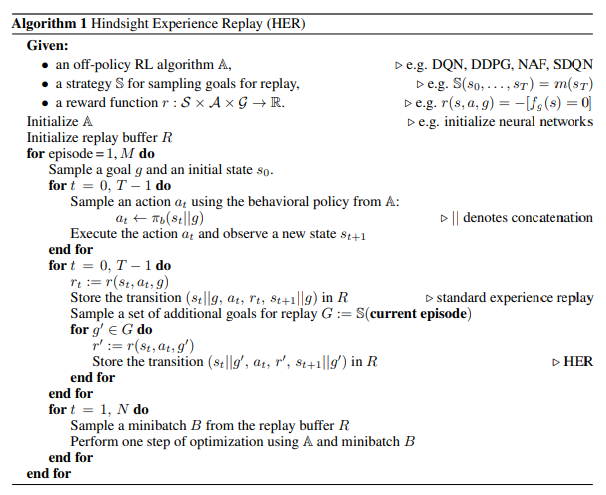
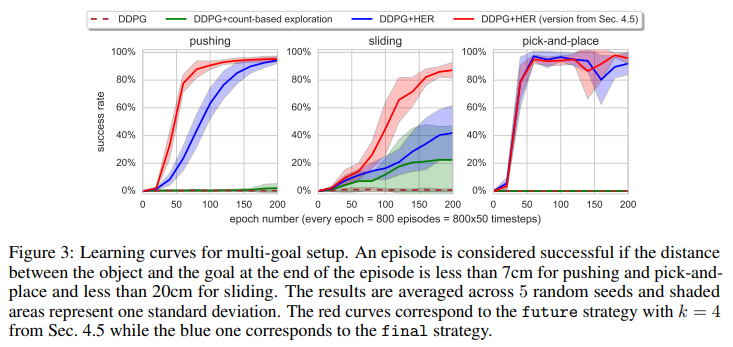
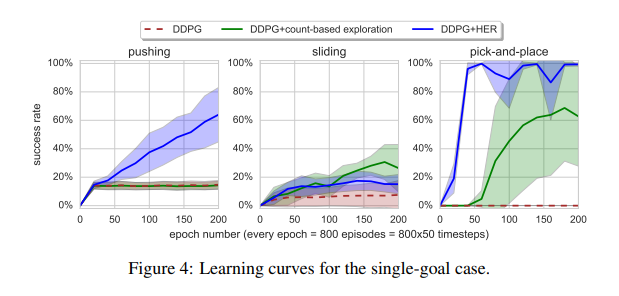

### HER `2017 NIPS`

---

- `Hindsight Experience Replay`

      Sparse and Binary reward로 복잡한 문제를 해결해냈다.
      
        -> 복잡한 reward engineering 불필요
          -> RL expertise and domain-specific knowledge 필요없다.
          -> 해당 task가 완료됬다는 On, Off signal만으로 학습이 가능하다.
          
        -> 어떠한 Off policy RL에도 적용 OK
        -> Implicit curriculum으로 볼 수 있다.
        

      Input으로 현재 state 뿐 아니라, goal state도 같이 받는다.
        -> Universal policy 학습 
        
        
      Key Idea:
      
          Replay each episode with a different goal.
          Not the one the agent was trying to achieve.
          (해당 epsiode에서 달성할 수 있는 goal들 중 하나로)
          
          
          Ex) Episode 1이 원하는 목표 지점에 도달하지 못했을 때
          
              Normal version : 이 epsiode 1은 실패다. (Learn little)
              HER version    : 이 epsiode 1은 이런 지점에는 다다를 수 있다. (Learn more)

---
- `Universal Value Function Approximators (UVFA)`

        UVFA는 DQN의 확장이다.
          -> 우리가 이루고자 하는 Goal이 하나 이상일 때를 위해 제안 

          G   : possible goal의 집합 
          g   : G의 원소
          r_g : 각각의 goal은 모두 어떤 reward function에 대응 r_g
            -> 내가 A 지점이 목표일 때랑 B지점이 목표일 때랑 움직일 때 reward가 같으면 안되지?

        Episode는 p(s, g) 분포에서 state, goal pair를 sampling하면서 시작된다.
        매 time step 마다 agent는 current state + current goal을 입력으로 받고 
        r_g(s, a)에 대한 reward를 받는다. ( r_g : goal과 관련된 reward function )

        또한 state와 goal을 어떤 조건부 확률적 형태로 연결시킨게 아니라 단순히 concatenate 시킴

            -> 좋은 approximator(neural network 등)라면 알아서 잘 분간할 것이라 기대 
                -> 역시나 좋은 결과를 얻었다. 
          

---
- `Count-based exploration method`

    
        
        Count-baesd exploration은 덜 방문한 state나 action을 더 열심히 exploration하게 하는 방법
        Sparse reward / large state space에서 잘 사용되는 방법 
        
            각 state, action을 몇 번 방문했는지 count한다.
            Agent는 단순히 estimate value만으로 다음 state, action을 선택하는게 아니고,
            estimate value + state 방문 수 / action 방문 수에 따라서 준 bonus를 포함해서 다음 state / action을 선택한다. 

            *bonus : 덜 방문한 state / action에 큰 weight를 주도록 설계 

                -> 대표적인 방법 : UCB1 algorithm 

        

---
- `Hindsight Experience Replay`

    
        *Example
        
        Sparse reward & Large searching space의 문제의 경우 
        기본적으로 사용됬던 exploration을 향상시키는 기법들은 도움이 하나도 안된다.
          -> VIME, Bootstrapped DQN, Count-based exploration ...

        방문하는 state의 다양성이 문제가 아니라, 애초에 그 넓은 searching space를 다 훑기에는 impratical하기 때문
        이 문제를 해결하는 기본적인 해법?        
          -> Agent가 goal로 갈 수 있게 guide를 해주고 더 imformative한 reward function을 정의하는 것 
            -> 즉, task specific하게 reward engineering 빡시게 해주는 것
        
 

        HER가 제안한 방법에 따르면 domain-specific한 지식없이도 해결할 수 있다.
        
        State squence가 s1 -> s2 -> s3 -> s4인 episode가 있다.
        그리고 s1, s2, s3, s4 모두 goal state가 아니다.
        
        agent는 위 epsiode를 경험할 때, -1의 reward만 계속 받을 것이다. (goal state에서만 +1)
        
        HER의 접근은 이 trajectory를 다른 goal로 다시 보자는 것
          -> 이 trajectory가 goal state로 가는 길에 대해서는 도움을 주지 못해도,
             어떻게 s4에 도달할 수 있는지는 알려주지 않냐!

 
---

 

`HER algorithm`

---
- `Experiment`

        1. Multi-goal에 대해서 더 성능이 좋다.
        2. Final strategy <<< Future strategy
        3. Sparse reward 문제를 푸는데 아주 성능이 좋다. 더 나아가서 이게 아니면 문제를 못푸는 경우가 많다. 
        4. reward shaping 하면 성능이 떨어진다 -> pure sparse binary reward일 때가 더 좋더라

`DDPG with & without HER`

 

`Multi-goal vs Single-goal`

