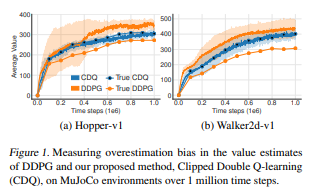
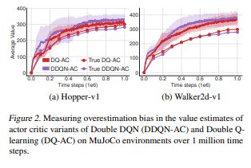

### TD3 `2018`

---

- `TD3`

        Estimating error로 인해 일어나는 두 가지 결과에 대해 집중적으로 다룬다.
        
          1. Overestimation bias problem
          2. Variance problem 

        # 위 문제를 해결하기 위해 제안된 방법들

          1. Clipped double Q Learning
          2. Target Policy smoothing 
          3. Delayed Policy update  

---

- `Overestimation bias`

        (Contribution of variance to Overestimation bias)

        * Overestimation bias in Discrete action space & Continuous action space
  
          Discrete action space에서 overestimation bias는 well studied
          하지만 Actor Critic setting에서의 Continuous action space에서의 bias는 아직 잘 연구되지 않았음
              
          -> 실험 결과 DDPG에서도 overestimation bias이 존재하지만, 기존의 double DQN 방법은 큰 효과가 없다.
  
              왜? Actor-Critic setting에서 policy가 생각보다 굉장히 천천히 변한다. 
              따라서 current network와 target network 간의 차이가 미미
                -> independent estimation을 만들기엔 두 네트워크가 너무 비슷하다.
                   (* Q1, Q2 두 value estimate이 서로 independant하다면 double q learning으로 unbiased estimate 가능)

                  -> 기존의 double Q learning 방법을 쓰는걸 추천하지만 이것도 Overestimation bias를 완전히 없애지는 못함
                  -> 또한 double Q learning setting에서 Unbiased estimate조차도 high variance에서는 Overestimation bias를 만든다. 
                    -> Paper에서는 이 두 문제를 해결할 수 있는 Clipped Double Q Learning 을 제안 !
                      (일종의 Upper-bound를 만들어 해결!)
  

 

                  

        * Clipped Double Q Learning

          double Q learning에서의 Q1, Q2도 사실상 완전히 independent 하지 않다. -> data correlation -> variance 증가 

              1. target을 학습할 때, 서로를 사용한다.
              2. Same replay buffer를 사용한다. 

          결과적으로 학습 variance가 큰 경우, 특정 state에서  Q2(s, π1(s)) > Q1(s, π1(s)) 인 경우가 있다.
          이 경우, Q1(s, π1(s))는 일반적으로 overestimate이 발생한다고 가정하는데, 이 값보다 더 크게 평가된 값을 이용하게 된다.
          다시 말해, Q2(s, π1(s))는 과평가된 값보다 더 과평가 되어있다.

          이 문제를 해결하기 위해 target network로 min{Q2(s, π1(s)), Q1(s, π1(s))} 를 사용한다.

          위와 같이 정의하게 되면, 일반적으로 Overestimation된 Q1(s, π1(s))이 일종의 Upper bound가 된다.
          따라서, Q2(s, π1(s))는 일반적으로 Underestimation이고, 만약 Q1(s, π1(s))보다 더 과평가된 경우에는 적어도 이 값을 넘지 않게 된다. 

          y1 = r + γ*min{Q2(s, π1(s')), Q1(s, π1(s'))}

          *
          즉, Q learning의 과평가를 해결하기 위해 만들어졌던 double q learning이 Actor critic setting에서 오히려 과~과평과를 할 때가 있다.
          따라서, double Q learning이 적어도 Q learning의 과평가보다는 못한 모습은 보여주지 않도록 Upper bound를 만들어주었다. (So kind..)   

---

- `Addressing variance`

        * Accumulating Error 

          TD 기반 업데이트는 estimated value를 통해 다음 값을 estimate한다. (bootstraping)
          따라서 erorr가 쌓인다. (build of error / error propagation)
          
          이 쌓이는 에러는 large overestimation error나 suboptimal policy를 만든다.
  
          이 문제는 Bellman equation을 완벽히 만족시키지 못하는 function approximation setting에서 더 심각
            -> 매 update 마다 residual error를 남긴다 
                -> 이 에러가 축척  

 

        * Target Network
   
          Target Network는 학습 과정에서 stability를 얻는데 아주 유용하다.
          fixed target network가 없다면, 매 업데이트마다 residual error가 발생 (계속 쌓임)
          이렇게 쌓이는 에러가 그 자체로도 겁나 해로운데, 이 value estimate를 maximizing하도록 policy를 업데이트할 때 아주 재앙이 된다. (발산) 
  

          Fixed policy와 Learned policy를 기준으로, target network를 soft update할때와 full update할 때를 비교했다.
  
          Fixed policy   : 
  
                    soft update rate τ에 관계 없이 모두 True value로 수렴
  
          Learned policy : 
  
                    τ가 작을수록 fluctuation이 적다.
                    τ가 클수록 개판 -> 발산하는 행동을 보임
                  

 

        * Actor Critic 학습이 실패하는 경우      
      
          Target Network가 없을 때 생기는 발산은 high variance를 가진 value estimation으로 policy를 업데이트한 결과임

          즉, Actor와 Critic 간의 상호작용의 실패가 발산의 원인이다.

            -> Policy가 개판일 때, Value estimation에 overestimation이 생김
            -> Value estimation이 개판일 때, 이걸 maximizing하려는 policy도 개판이 됨

 

        * Delayed policy update 

          만약 target network가 error를 줄이는데 도움을 준다면?
          그리고 에러가 그득한 states에 대해 policy를 업데이트하는게 발산하는 지름길이라면?

            -> 그럼 value update를 더 많이 업데이트해서 에러를 충분히 줄인 다음에 policy update를 업데이트 하는게 낫다.
               즉, 업데이트 주기 : Value network >> Policy network 

            -> 더 작은 variance를 가진 value estimation에 대해 policy update하는게 훨씬 더 질 좋은 업데이트! 당연한 말

 
          

        * Target policy smoothing

          DPG의 경우 value estimate이 어떤 한 peak에 집중적으로 overfit되는 경우가 있다.
          이러면 작은 noise나 부정확성에도 아주 예민해져서 학습 variance를 크게 만든다.
    
          이렇게 생긴 variance는 regularizationg으로 줄일 수 있다.
          이 regularization은 '비슷한 행동은 비슷한 값을 가질 것이다' 라는 가정을 깔고 간다.

          TPS는 target action 주변의 작은 영역의 값을 공략한다. 
          
            ---- y = r + Eε[ Q(s, π(s) + ε) ]

          즉, target action에 mini-batch 수 만큼 작은 noise들을 더해서 구한 value estimate에 평균을 취한다. 
          이 action들에 대한 value estimate의 평균값으로 target action을 근사한다.

          

