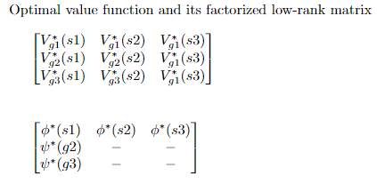
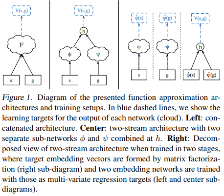
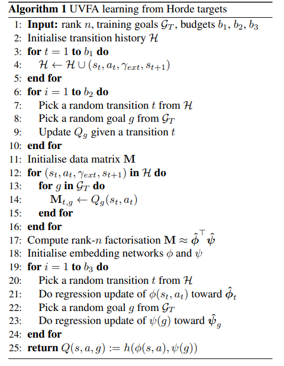
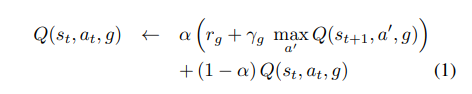

### UVFA `2015 ICML`

---
- `topics`

        1. UVFA concept 
        2. UVFA in supervised learning setting
        3. UVFA in reinforcement learning setting 
            - Generalizing from Horde / Direct bootstrapping

---
- `UVFA concept`

        일반적으로 value function(or approximator)은 현재 state에서의 expected return. (= V(s;θ)) 
        UVFA는 state 뿐만 아니라, goal도 같이 고려한 expected return을 제시한다. (= V(s,g;θ))

            -> 전에도 goal을 같이 고려한 Horde architecture, universal function 같은게 있긴 있었단다.

        이 UVFA를 통해, 모든 goal에 대해서 value function을 학습할 수 있다.

            i.e) set of goal = {toilet, bedroom, livingroom} 일 때,

                V(my_room, toilet; θ)     : goal = toilet이고, 현재 my_room 있을 때의 expected return  
                V(my_room, bedroom; θ)    : goal = bedtroom이고, 현재 my_room 있을 때의 expected return
                V(my_room, livingroom; θ) : goal = livingroom이고, 현재 my_room 있을 때의 expected return

            를 single stream으로 한 번에 학습할 수 있다는 얘기 -> 솔직히 이게 되나 했는데 역시나 믓찐 Tom 행님 
       
  
        UVFA에서는 data를 sparse matrix로 다룬다. -> learning architecture 보면 이해됨

            sparse matrix의 행 : observed states 
            sparse matrix의 열 : goals
    
        이 sparse matrix를 low-rank matrix로 분해한다. (SVD처럼)
    
            low-rank로 분해된 이후의 matrix의 행 : ϕ*(s)
            low-rank로 분해된 이후의 matrix의 열 : ψ*(g)

        이제 우리는 regrssion으로 이 ϕ*(s) / ψ*(g)를 잘 근사하는 ϕ(s) / ψ(g) 를 찾는다.. How? 

            state -> ϕ(s) / goal -> ψ(g) 로의 non-linear mapping을 학습할 것 (Neural network)   

        이걸 잘 학습시켜놓으면 처음 보는 (state, goal) 조합에 대해서도 아주 잘 동작한다.
            -> generalization good ... 

        여기서 말하는 sparse matrix의 원소들은 true target value (optimal value function)
        low-rank matrix 원소들도 true target value (optimal value)

            근데 그냥 low-rank로 분해하지 말고 sparse matrix 그대로 regression 하면 되지 않나?
                -> low-rank로 변환해도 잡아낼 정보는 다 잡아내고, regression이 훨씬 빠르단다. 
                   (여기 실험에선 dim = 7이면 충분하댔음.)

        UVFA의 concept은 state, goal 모두를 아우르는 sparse matrix 내의 많은 optimal value 들을 
        single, unified function approximator로 해결한다는 것 
        

---
- `Horde architecture`

        Paper에서 비교하는 Horde method에 대해 간단히.

        Ex) 4x4 tabular case. 

        Horde architecture는 4x4 16개의 격자를 각각 goal로 하는 16개의 demon을 생성한다. 
        이제 각자의 goal state를 가진 16개의 demon이 각자 value function을 학습한다. 

            -> This is Horde architecture 
---

- `UVFA in supervised learning setting`

        3가지 구조가 있고 paper에서는 3번째 구조 선택 

        # two stage - two stream :
                
                stage 1 : true target value matrix 생성 -> low-rank matrix로 분해 ϕ'(s) / ψ'(g) get (target embeddings) 
                            
                stage 2 : input state, goal / output ϕ(s), ψ(g)의 non-linear mapping을 학습 (target : ϕ'(s) / ψ'(g))
 

        state 1 - target embedding들을 get
        state 2 - actual s, g에서 이 target embedding을 얻는걸 목표로 학습  

---

- `UVFA in Reinforcement learning setting`

        Supervised learning setting과는 달리 ground-truth target value가 없다.
        더군다나, 더이상 state가 fully observable하지도 않다. 
        
        여기서 2가지 방법이 있다.
        1. Generalization from Horde
        2. Direct bootstrapping 

        #1 Generalization from Horde 

            Horde architecture의 각 demon은 1개의 goal에 대해 value function approximation을 찾는다.
            이를 통한 UVFA 방법은, Horde를 통해 얻은 값들을 target matrix의 원소로 하는 것이다.
            이후 기존의 two-stage two-stream 방법을 쓴다. 

                *Algorithm 1 (lines 2-10)을 보면, Horde가 학습한 Q(s,a;g)를 모아서 matrix M을 만든다. 

                    demon 1 -> Q(s, a; g1) 
                    demon 2 -> Q(s, a; g2)
                    demon 3 -> Q(s, a; g3)

            
            Horde를 이용한 방법의 퀄리티는 Horde가 축척한 exprience를 양에 의존적이다. 
            또한 들어오는 data가 agent가 environment에서 explore하는 족적에 의존적이라는 게 문제.
            대부분의 경우, 우리가 원하는 goal에 관련된 데이터가 많지 않다. 

                예를 들어, 4x4 tabular case에서 16개의 demon이 있다고 하면, 
                우리는 goal = (4, 3)이 목적인데, agent가 탐험하는 구간이 여기랑은 동떨어진 부분이라면, 
                이 goal을 갖는 demon을 학습할 데이터가 안나올 수 있다는 게 문제.  
                

                

            

        #2 Direct bootstrapping 
  
          Horde를 써서 우회하는거 말고 UVFA를 Q learning으로 바로 학습할 수도 있다.         

          goal에 대해 generalizing 하는 동시에 function approximation으로 bootstrapping하기 때문에 
          학습이 좀 불안정하다 -> learning rate 조절해서 해결할 수 있다. 

