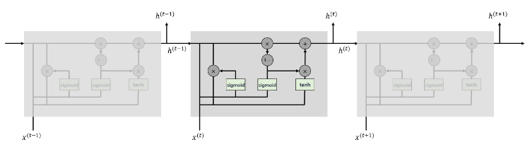
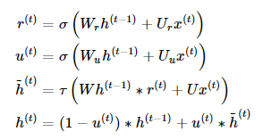
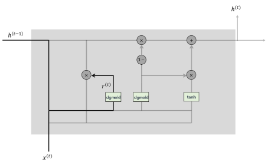
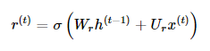
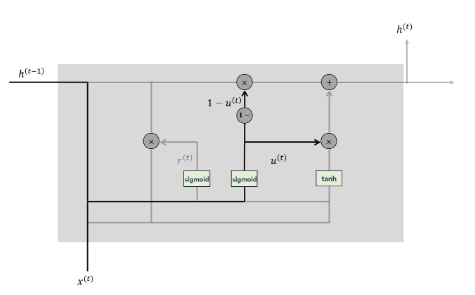
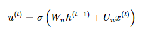
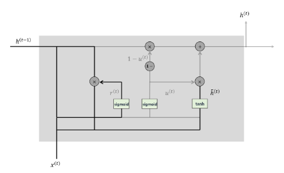
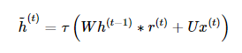
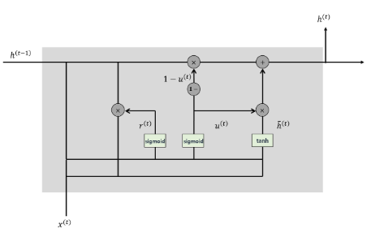

### GRU

[GRU reference](https://yjjo.tistory.com/18)

---

- `Gated Recurrent Unit`

    
        LSTM과 성능은 유사하면서 복잡했던 구조를 간단화 (조경현 NY prof. paper)
        LSTM에 비해 GRU가 학습할 가중치 수가 확연하게 적다. (학습이 빠르고 가볍다.)

`GRU`

    GRU는 Reset gate, Update gate, Candidate, output 4가지 단계를 고려하면 된다.

 

`Reset gate`

    이전 cell에서 던져준 정보를 적당~히 리셋시키는게 목적
    바로 이전 cell에서 받은 hidden unit 정보와 지금 넣어준 입력 정보를 적당히 리셋 

 

`Update gate`

    LSTM의 forget gate와 input gate의 짬뽕
    인자 이전 정보랑 지금 정보를 얼마나 섞어줄건지 결정

    이전 hidden unit h(t-1)이랑 지금 입력 정보 xt를 적당히 섞어서 0~1 사이 값으로 
        0 : 다 이자뿌기  
        1 : 몽땅 가져가기

    u : 현시점 정보의 양 -> input gate 
    (1-u) : 빼먹은 정보의 양 -> forget gate 

 

`Candidate`

    다음 시점으로 넘겨줄 정보 후보군을 계산하는 단계 (!= ht)
        -> 요놈이랑 h(t-1)이랑 적당히 섞어서 ht 만들 것!

    과거 hidden unit 정보를 그대로 이용하지 않고, reset gate 결과를 곱해서 이용한다는 것 
    tau : tanh, * : pointwise 곱셈

 

`Hidden unit ht`

    Update gate 결과랑 candidate 결과를 이용해서 다음 hidden unit에 던져줄 ht 계산하는 단계
    

