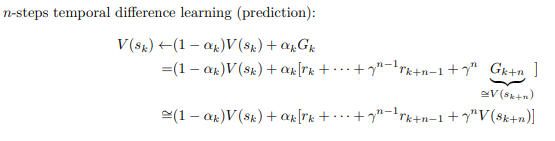
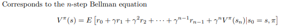
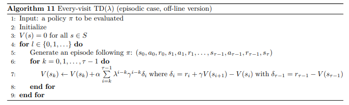
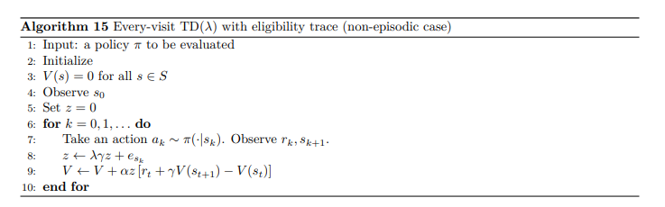

#### Eligibility trace for POMDP

Memoryless approach for delayed RL 

---

- `N-step TD`

        TD-learning과 Monte Carlo의 쨈뽕

---

- `TD(λ) - forward learning`

        N-step TD에서 N 값 찾기 너무 번거로바서 제안 (λ - smoothly changes in 0~1) 
        + Episodic case에서만 사용가능 

        1. λ = 0 : TD(0)                   --- Small variance / Bias 존재
        2. λ = 1 : TD(1) = Monte Carlo     --- Large variance / Bias X
        3. 0 < λ < 1 : TD + Monte Carlo    --- 적당~

---

- `Eligibility trace - backward learning` 

---

- `Eligibility trace for POMDP`