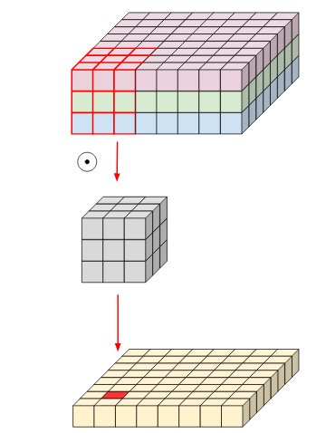
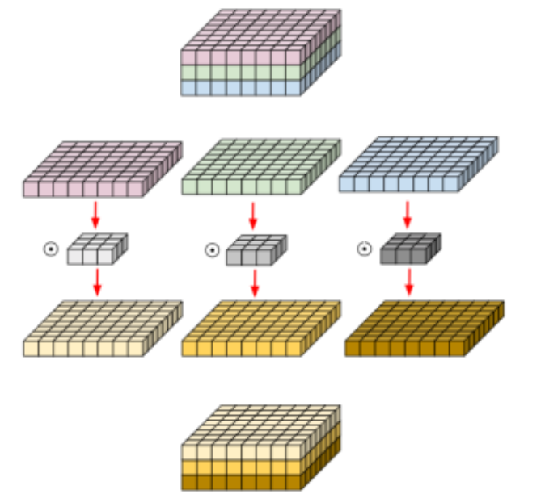
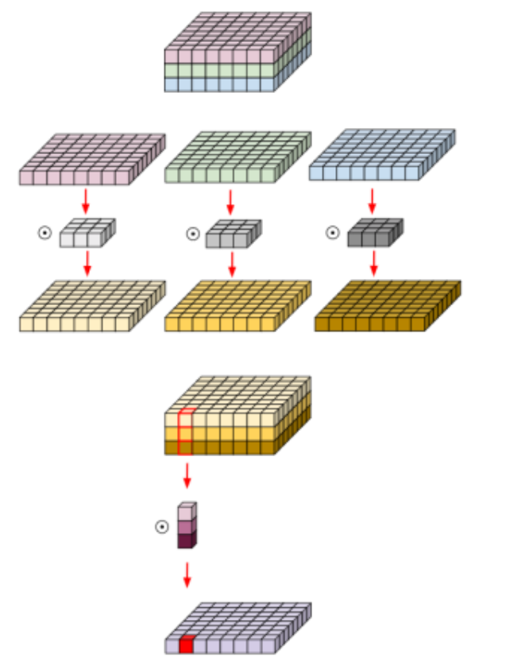

## `DepthWise Convolution`

- Basic Convolution

우선 `일반적인 Convolution`은 아래 그림과 같다.

입력이미지 : 8 x 8 x 8 , Filter   : 3 x 3 x 3

이 때, filter 1개가 가지는 파라미터 개수는 27(3x3x3)개 이다.

그리고 만약 filter의 개수가 4개라면 27 x 4인 108개 인 것이다.  

 

- Depthwise Convolution

아래 그림은 `DepthWise Separable Convolution`이다.

기존 Convolution 연산은 모든 채널을 filter가 Receptive 크기만큼 포함해서 계산했다.

`DepthWise Convolution`연산은 다음과 같다.

      채널을 모두 분리시킨 뒤, Channel axis 길이가 항상 1인 여러 개의 filter를 사용해서 Conv연산 수행

 

`Depthwise Conv` 과정을 자세히 살펴보면 다음과 같다.

      1. 입력 영상을 채널 기준으로 모두 분리한다.
      2. 채널 축 길이가 1인 Filter로 채널 마다 Convolution을 수행한다.
      3. 출력 결과를 채널 기준으로 다시 합친다.

 

- DepthWise Separable Convolution

다음으로`DepthWise Separable Convolution`이다.

위의 `DepthWise Convolution`의 결과에 채널 크기의 Conv filter를 적용한 것이다.

 

이처럼 복잡한 연산을 수행하는 이유 다음과 같다.

     1. 기존의 Conv와 유사한 성능을 보인다.
     2. Parameter 수와 연산량이 획기적으로 줄어든다.

      ex) filter 크기가 3x3x3이고, filter 개수가 16개 일 때의 파라미터 수 

            * (height x width x channel x num_filter)

         Convolution : 3 x 3 x 3 x 16 = 432 개 
         
         Depthwise   : ( 3 x 3 x 1 x 3 ) + ( 1 x 1 x 3 x 16 ) = 75 개 

 

#### 왜 파라미터가 줄어드는가?

`DepthWise Separable Convolution`은 기존의 Convolution filter가 `Spatial dimension`과 `Channel dimension`을 동시에 처리하던 것을 
분리해서 각각 처리한다고 볼 수 있다. 이 과정에서 여러 개의 filter가 `Spatial dimension` 처리에 필요한 파라미터를 공유하게 되서 총 파라미터 수를 줄일 수 있다는 것이다.

