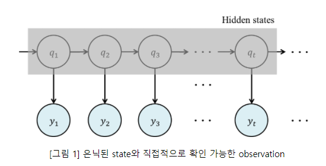

## Hidden Markov Model

[참고 링크 1](https://sanghyu.tistory.com/17)      

Markov Chain은 모든 State에 대해 관찰이 가능한 시스템이다. 
 
          * 1차 Markov Chain은 모든 State를 다 볼 필요는 없고, 그 이전 State만 들여다 볼 수 있으면 된다 
          * 2차 Markov Chain은 모든 State를 다 볼 필요는 없고, 그 전과 전전 State만 들여다 볼 수 있으면 된다 
      
하지만 Hidden Markov Model은 모든 State가 아니라, 그 중 일부 State만 들여다 볼 수 있을 때 사용하는 모델이다!
      
 
 

- Hidden?

Hidden Markov Model은 Markov Chain과는 다르게 일부 State만 관찰이 가능한 모델이다.  
(주로 Sequential한 데이터의 분류에서 사용된다)

      * Hidden은 Markov Chain에서의 State가 숨겨져있다는 것을 의미한다

            1차 Markov Chain을 예로 들어보자.

            우리가 다음 State를 예측하고 싶어서 지금의 State를 들여다 보아야하는데, 이 State들이 일부 숨겨져 있는 것이다..

- Hidden Markov Model

      HMM은 Markov Chain에 숨겨진 State와 직접 확인이 가능한 Observation을 추가해서 확장한 것이다.

      이 Observation을 가지고 숨겨져있는 state를 추론하기 위해 사용되는 것이 HMM이다.

            단, 관측치 Observation은 숨겨진 state에 종속적으로 발생한 것이다!

 

아래 그림은 숨겨진 State와 그에 해당하는 관측치의 개념을 나타내며, 우리가 관측 가능한 것은 오직 y sequence이다. 

**y는 q에 대해 종속적으로 발생한다고 할 때, y를 통해 숨겨진 state Sequence q를 추론한다!**

    
