## Hidden Markov Model

- 참고링크 

[참고 링크 1](https://sanghyu.tistory.com/17)       
[참고 링크 2](https://untitledtblog.tistory.com/97)  
[참고 링크 2](https://ratsgo.github.io/machine%20learning/2017/03/18/HMMs/) 

---

 

#### Before Hidden Markov Model ...

- Markov Chain 

Markov Chain은 모든 State에 대해 관찰이 가능한 시스템이다. 
 
          * 1차 Markov Chain은 모든 State를 다 볼 필요는 없고, 그 이전 State만 들여다 볼 수 있으면 된다 
          * 2차 Markov Chain은 모든 State를 다 볼 필요는 없고, 그 전과 전전 State만 들여다 볼 수 있으면 된다 
      
하지만 Hidden Markov Model은 모든 State가 아니라, 그 중 일부 State만 들여다 볼 수 있을 때 사용하는 모델이다!
      
 
 

#### Hidden Markov Model

- Hidden?

Hidden Markov Model은 Markov Chain과는 다르게 일부 State만 관찰이 가능한 모델이다.  
(주로 Sequential한 데이터의 분류에서 사용된다)

      *Hidden은 Markov Chain에서의 State가 숨겨져있다는 것을 의미한다

            1차 Markov Chain을 예로 들어보자.

            우리가 다음 State를 예측하고 싶어서 지금의 State를 들여다 보아야하는데, 이 State들이 일부 숨겨져 있는 것이다..

- Hidden Markov Model (HMM)

      HMM은 Markov Chain에 숨겨진 State와 직접 확인이 가능한 Observation을 추가해서 확장한 것이다.

      이 Observation을 가지고 숨겨져있는 state를 추론하기 위해 사용되는 것이 HMM이다.

            단, 관측치 Observation은 숨겨진 state에 종속적으로 발생한 것이다!

 

아래 그림은 숨겨진 State와 그에 해당하는 관측치의 개념을 나타내며, 우리가 관측 가능한 것은 오직 y sequence이다. 

**y는 q에 대해 종속적으로 발생한다고 할 때, y를 통해 숨겨진 state Sequence q를 추론한다!**

      HMM은 3가지 Parameter로 구성되어있다. 아래의 3개의 Parameter를 찾으면 task에 맞는 HMM을 찾은 것이다!

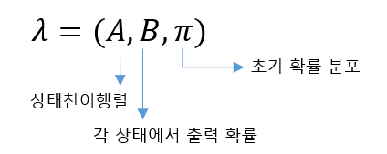

위 그림에서 **B는 방출확률 (Emission Prob), A는 상태천이확률(Transition Prob), PI는 초기확률(Initial prob)** 이다.  
B의 방출확률은 은닉된 상태로부터 해당 관측치가 튀어나올 확률이라는 의미로 생각할 수 있다.

미리 생각해 볼 것은 우리가 HMM 모델을 이용해서 다음의 문제(확률)를 추론한다는 것이다.

      Q : hidden State의 Sequence (q1, q2, ... , qN)
      O : Observation Sequence  (o1,o2, ... ,oN)
      
      문제 : P(Q|O)  : 관측된 O Sequence에 대한 숨겨진 Q Sequence의 확률

---

 

#### Start HMM

- HMM의 동작 

      1. 특정 Observation Sequence O가 나타날 확률 (forward - bacwkard Algorithm)
      2. 특정 Observation Sequence O에 대해서 Hidden Sequence Q가 나타날 확률 (Viterbi Algorithm)
      3. Parameter (A, B, PI) Update - EM Algorithm (Baum-Welch Algorithm)

      여기서 3번의 의미가 애매한데, 잘 생각해보면 다음과 같다.
      
        어떤 모델에서 관측열 O의 집합이 주어질 때, 이 O들을 가장 잘 설명하는 모델을 구하는 과정이다. 
        즉, 해당 관측열의 집합을 가장 잘 설명하는 모델의 파라미터 A, B, PI를 구하는 과정 

 

- Forward - Backward Algorithm

해당 모델(A, B, PI)에서 특정 관측열 Sequence O가 나타날 확률을 구하는 과정

      쉽게 말하면 모델 λ가 주어졌을 때, 관측치 O가 나타날 확률 P(O|λ)을 찾는 과정이다.  
      즉, 우도 (Likelihood)를 구하면 된다.

근데 왜 Forward - Backward algorithm이라 불릴까?

    우리가 이제 알아볼 우도를 구하는 과정을 Forward로 진행해도 되고, backward로 진행해도 되기 때문이다.

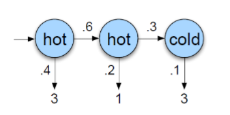

위 모델은 1th Markov Chain을 따른다고 가정한다. 따라서 State 확률을 계산할 때는 직전 상태만 고려한다. 

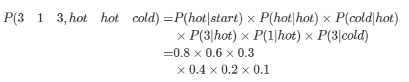

위 그림에서 Start에 해당하는 확률은 모델 λ의 초기 확률 PI에 있다.

수식의 첫 번째 줄은 상태 천이 확률 P(현재 상태 | 이전상태)  
두 번째 줄은 방출 확률 P(관측 상태 | 은닉 상태) 

 

위의 수식과 같이 hot - hot - cold의 hidden state sequence를 가질 수도 있지만, 

hot - cold - hot,   hot - hot - hot , ... 등의 Sequence를 가질 수도 있다.

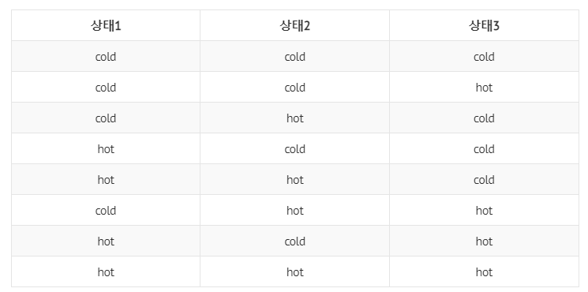

총 8개의 가능한 Sequence가 있으며 이 8개의 Sequence 확률을 모두 더한다.

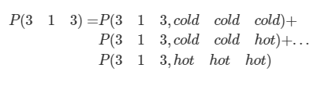

      결과적으로 관측치 [3, 1, 3]에 대한 우도를 구하였다. 

 

위의 예시로 우도 P(O|λ)를 계산하는 방법을 이해했다.

이를 전체 모델 데이터에 대해 확대해서 사용하면 되는데, 상상 이상으로 연산량이 많아진다. 

**따라서 DP를 사용한다.** (이미 계산한 결과를 저장해두었다가 다시 재사용하는 것)

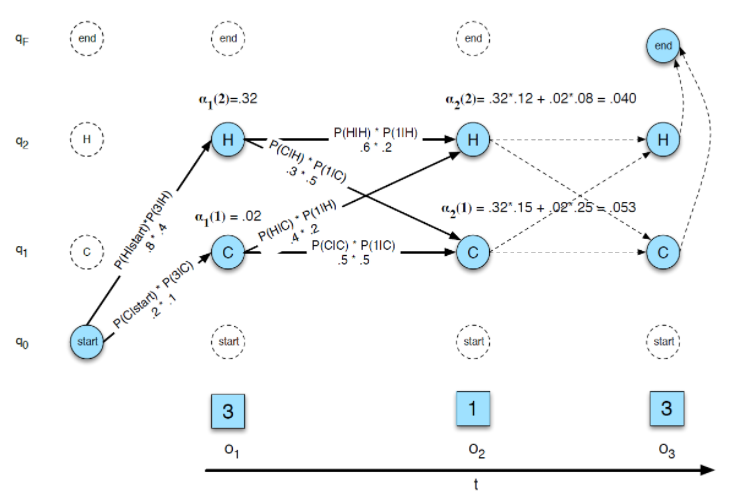

예를 들어 a2(1) : 2 번째 시점에서 o1, o2의 관측열이 나타나고 , 날씨가 추웠을 확률을 구해보면 다음과 같다. 

( at(j) : j번째 상태와 o1, o2, ... ,ot의 Sequence가 나타날 확률 )

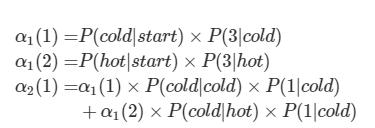

정리하자면, j 번째 상태(hot or cold)에서 o1, o2, ... , ot의 관측열이 나타날 DP를 이용한 전방확률 a는 다음과 같이 정의된다.

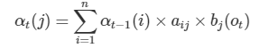

이제 이 전방확률을 관측치 Sequence 끝까지 계산하면 앞 서 계산한 우도가 된다. 

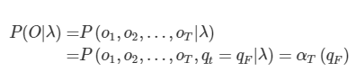

여기서 qF는 가능한 모든 State를 계산하면 된다 .

      즉, P(O| qt = hot) + P(O| qt = cold) = P(O|λ) 
  
      또는 다음과 같이 표현 가능
  
      at(hot) + at(cold) = P(O|λ)

 

- Viterbi Algorithm

우리의 두 번째 목표는 우도 P(O|λ)를 알아냈을 때, 해당 우도로 부터 가장 확률이 높은 Hidden State Sequence Q를 찾는 것이다. 

        이를 Decode 과정이라고 한다. 이 Decode 과정에 Viterbi Algorithm을 사용한다.

 

Viterbi Algorithm의 계산 대상인 Viterbi 확률 v는 다음과 같이 정의된다. 

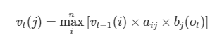

Viterbi 확률은 궤적을 찾아내도록 도와준다. 의미를 뜯어보면 다음과 같다.
    
    a_ij : i -> j 로의 상태 천이 확률 
    b_j(ot) : t 번째 hidden state에서 j번 째 관측치가 나올 확률

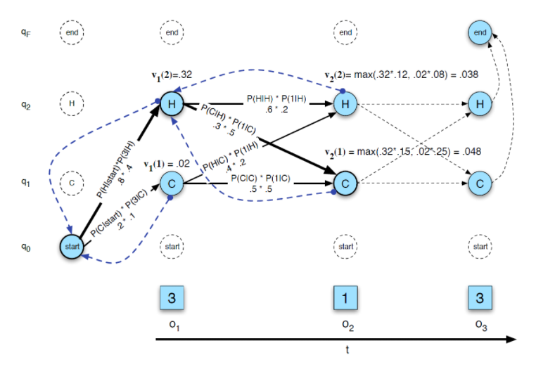

각 상태에서 viterbi 확률 v 를 구하는 예시는 다음과 같다. 

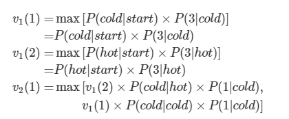

    Backtrace Sequence는 이러한 최적상태열을 list에 저장한 결과이다.

위 수식의 결과로 얻는 것은 다음과 같다.

      관측된 아이스크림 소비량이 [3, 1]일 때, 가장 확률이 높은 Hidden Sequence는 [Hot , Cold] 이다!

 

 

전방확률을 계산하는 과정을 비교해보면 Forward Algorithm과 굉장히 유사하다.

    자세히 살펴보면 Forward algorithrm과 Viterbi algorithm은 Sum과 Max의 관계임을 알 수 있다.

      Forward algorithm은 우도를 구하기 위해 모든 확률을 더해주었다.

      Viterbi algorithm은 가장 높은 확률의 경로를 계산하기 위해 모든 확률 중 Maximum 값을 취한다.

 

- EM Algorithm - Baum-Welch Algotirhm

이제까지 Forward-backward algorithm과 Viterbi Algorithm을 이용해서 숨겨진 State를 찾아내는 방법을 이해했다.

근데 우리가 Forward를 해서 우도를 구하든, Viterbi를 통해 최적상태열을 찾아내든 모델이 주어져야 가능했다.

      즉, λ (A, B, PI)가 있어야한다.

 

**EM Algorithm을 이해하기 위해서는 확률 기초지식이 있어야 하므로 추후 다시 업데이트!**

    

