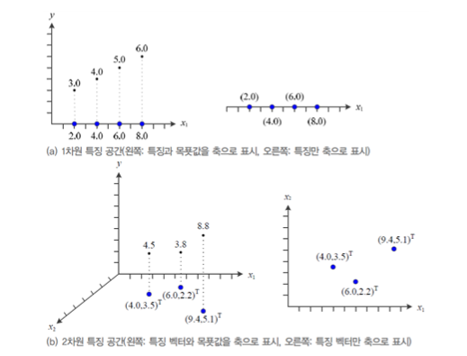
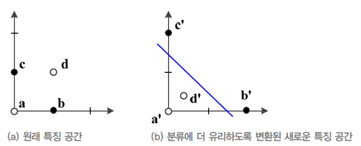

### 특징공간

평소에 헷갈렸던 부분이나, 선형대수에서 자주 생각해야하는 부분을 정리해보자.

    특히 특징 공간이라는 개념에 대해서 중심을 잡을 필요가 있다.
    
    또한 PCA를 공부하기 전 벡터 공간에 대해서도 잘 이해하고 있어야할 것 같다.

---

 

- 특징 공간

특징 공간은 쉽게 말해서 `특징 데이터들이 있는 공간`을 뜻한다.

`특징 공간`을 `feature space`라고 하면 더 이해하기 쉽다.

또한 이어서 얘기할 `특징 공간의 변환`이라는 개념도 매우 중요하다.

     

 

- `1차원 특징 공간` 

    x data의 feature가 1개 (키)

 

- `2차원 특징 공간`

    x data의 feature가 2개 (키, 몸무게)

 

- `3차원 특징 공간`

    x data의 feature가 2개 (키, 몸무게, 나이)

        주의할 점은 feature들이 서로 독립이어야한다는 것이다.
        즉, 'feature 개수 == 차원' 은 항상 성립하지는 않는다.
            
            이후 벡터 공간에서 더 생각해보자.

 

- 특징 공간의 변형

특징 공간의 변형은 무엇을 의미할까?

가장 이해하기 쉬운 예로 `XOR` 문제가 있다. 다음 그림을 살펴보자

 

`(a)`의 그림은 한 개의 직선으로 두 부류의 데이터를 분류할 수 없다. 

이를 가능하게 하기 위해서 기존 Perceptron에 층을 늘린 Multi layer Perceptron이 등장한다.

그럼 MLP가 어떻게 이 문제를 해결하였는지는 그림 `(b)`를 보면 이해할 수 있다.

    즉, 은닉층을 써서 '기존 특징 공간'을 '새로운 특징 공간 z' 로 바꾸어놓고 다시 선형 분리를 수행한다.

        선형 분리 : 결정직선(2차원), 결정평면(3차원), 결정초평면 (4차원 이상 ..) ...  선형이면 된다.

 

정리하자면 우리가 현재 사용하고 있는 Neural Networt는 특징 공간을 변형시키는 방법인 것이다.  

`MLP가 하는 일은 특징 공간에 있는 데이터를 새로운 특징 공간으로 Mapping해서 선형 분리를 수행하는 것이다!`

---

 

#### 정리

기계 학습을 처음 공부할 때, 어떻게 Layer를 쌓는 것으로 직선이 곡선이 되는지에 대한 의문이 많았다.

하지만 이러한 고민들은 다음을 것들로 정리할 수 있을 것 같다.

        1. Layer를 쌓는 것은 선형 분리하기 유리한 특징 공간으로 변형시키기 위한 것이다.
        2. 곡선에 대한 것은 다음과 같이 이해할 수 있다.

            - 변형된 특징 공간에서 선형 분리를 수행한다.
            - 이 공간에서의 직선(평면, 초평면, ..)은 앞선 layer들의 특징 공간에서 보면 곡선으로 보인다.  

