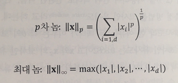
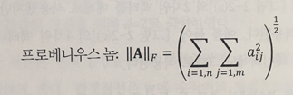
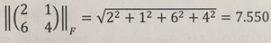
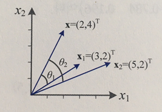
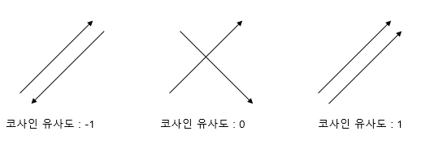
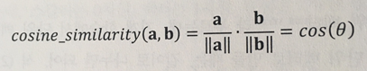

### `놈`과 `유사도`

Machine Learning의 가장 중요한 연산 중 하나는 두 sample 간의 유사도를 측정하는 것이다.

따라서 유사도에 대해서 간략하게 알아보자.

---

 

#### Norm 

- Norm

`Norm은 벡터의 크기를 정의할 때 사용한다` 

        즉, 화살표의 길이로 생각할 수 있다.

            예를 들어 2차 Norm은 L2 Norm이라 하며 가장 자주 사용하는 유클라디안 거리이다.
    
            ||x||2 = np.sqrt( (a1^2 + a2^2) )
 

p차 Norm은 `Lp Norm` 이라고 한다.

 

- 단위 벡터 

`단위 벡터는 벡터를 Norm으로 나누면 된다.`

 

- 프로베니우스 놈

이제 벡터가 아닌 `행렬의 Norm`을 생각해볼 수 있다.

행렬의 Norm은 훨씬 더 많은 형태가 있는데, 기계 학습에서 자주 사용하는 `프로베니우스 놈`만 살펴보자

 

        프로베니우스 놈은 각 원소들의 제곱합의 제곱근이다.

예를 들면 다음과 같이 사용할 수 있다. 

---

 

#### 유사도 

먼저 X를 기준으로보고 X1과 X2 중 어떤 것이 X와 가장 유사한지를 살펴보는 것을 생각해보자

- 내적

`내적`은 두 벡터가 `똑같을 때` 가장 큰 값이 된다. (벡터가 똑같다 = 방향이 같고 Norm이 같다.)

반대로 두 벡터가 `수직일 때` 0이 되어 가장 작은 값이 된다. 

하지만 벡터가 길기만 하면 (Norm이 크기만 하면) 유사도가 커지는 문제가 있다. `(방향보다 크기의 값이 커, 내적 결과에 영향이 더 크기 때문이다.)` 

        예를 들어 X⋅X1 = 14 이고 X⋅X2 = 18 이므로 X2가 X와 더 유사하다고 볼 수 있다.

        하지만 실제로는 X1이 더 유사하다

 

따라서 여기에 따른 대안으로 `Cosine Similarty` 가 자주 사용된다.

- Cosine Similarty

`코사인 유사도`는 두 벡터 간의 `코사인 각도를 이용`해서 구할 수 있는 `두 벡터 간의 유사도`이다.

두 벡터의 방향이 완전히 `동일한 경우`  : 1

두 벡터의 방향이 서로 `수직일 경우`    : 0

두 벡터의 방향이 완전히 `반대일 경우`  : -1

 

`코사인 유사도는 다음과 같은 식으로 정의한다.`

두 벡터의 내적을 각 벡터의 Norm의 곱으로 나눈다.

의미를 잘 생각해보면, `각 벡터를 단위 벡터로 만든 후 내적하는 것`이다. 

 

- distance

코사인 유사도는 정보검색 분야에서 주로 두 문서의 유사도를 계산하는 데 사용한다. (자연어 처리 분야)

        하지만 벡터의 크기를 유지하면서 유사도를 구해야하는 경우에는 적절치 않다.

이러한 경우에는 `유클라디안 거리 (L2 distance)`를 사용한다. 

        유클라디안 거리 외에도 해밍 거리, 매니폴드 거리 등이 있다. 

---

 

