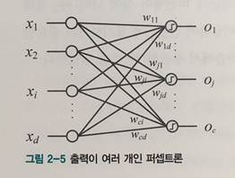

#### `Perceptron and Similarity`

MNIST dataset을 분류할 때, 마지막 단에 softmax activation function을 이용해서 값을 조정해 분류를 진행했다.

        그럼 가장 큰 값이 나온 Class는 어떤 이유로 가장 큰 값이 나온 걸까? 

 

`Norm과 유사도`를 공부하면서 조금 깨달음을 얻었다.

---

- `신경망`과 `유사도` 연결하기

`벡터의 내적을 유사도의 척도로 사용할 수 있다고 공부했다.`

아래 신경망의 가중치를 각 Node의 기준 벡터라고 생각해보자. (총 N개의 node)

이 때 임의의 입력 데이터 X를 넣어주었을 때, X는 총 N개의 기준 벡터 W와 `내적을 통해 유사도를 계산`한다.

    즉, X와 해당하는 노드의 기준 벡터 W_k와 유사도가 클 때 출력 결과가 크게 된다!

    위와 같은 과정을 통해 나온 출력 결과를 0 ~ 1 사이로 정규화시키는 것이 Softmax 활성함수 였던 것이다!

 

- `신경망 훈련`? 다시 생각해보기

신경망 훈련은 `가중치 W를 주어진 데이터를 잘 분류하도록 갱신해가는 과정`이라고 생각했었다.

하지만 `수학적`으로 생각해보면 다음과 같다.

    예를 들어 10개의 출력을 내는 1층 짜리 layer를 생각해보자.
    
    우리가 10개로 데이터를 분류할 때, 각 node들의 기준 벡터 W는 각 label 벡터와 유사도가 높은 벡터로 점점 갱신된다.

    따라서 우리가 특정 데이터를 입력으로 넣어주었을 때, 그 데이터와 내적했을 때 가장 높은 유사도의 벡터를 갖는 Class로 분류되는 것이다.

         
