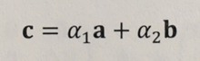
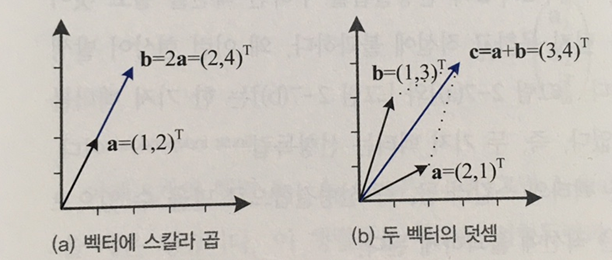
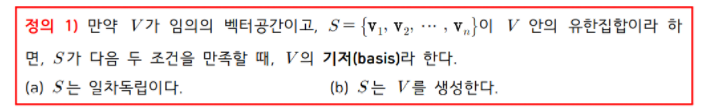
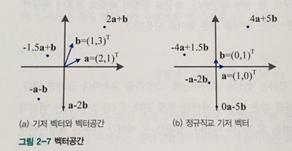
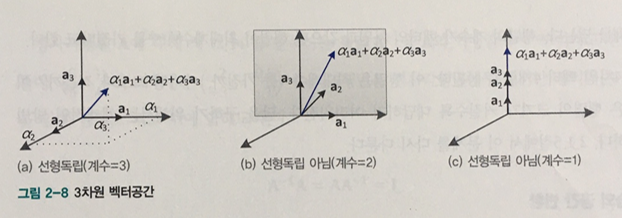
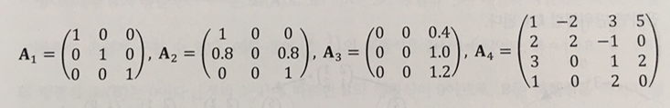

### 벡터공간

- 머리속에 정리해둘 것

       1. Basis Vector
       2. Orthogonal Vector / Orthonomal Vector
       3. Vector Space
       4. Rank
       5. Linearly Independant  
       6. Linear Combination 
 

#### Vector

`Vector`는 `공간 상의 한 점`에 해당한다.  또는 `화살표의 끝 점`에 해당한다.

 

#### Linear Combination

- `Linear Combination : 선형 결합`
  
벡터 공간을 이해하기 위해서는 먼저 선형 결합에 대해서 알아야한다.

`선형 결합`이란, 공간 상의 두 벡터를 각각 상수배하여 더한 것을 의미한다.

 

위 그림에서 두 벡터의 `선형결합`을 통해 C라는 새로운 벡터를 만들어 냈다.

**중요한 것은 바로 이 C 벡터 뿐 만아니라 α1, α2를 변화시켜가며 2차원 공간의 모든 점을 만들어낼 수 있다는 것이다!**

    벡터는 공간 상의 한 점이다.

---

 

#### Vector Space : 벡터 공간

`선형 결합`에 대해서 알아봤으니, 이 것이 `벡터 공간`과 어떠한 관계가 있는지 알아보자.

- Vector Space : 벡터 공간

위의 예에서 두 벡터를 이용해서 2차원 평면 상의 모든 점들을 표현할 수 있다고 했다.

이렇게 만들어지는 공간을 `벡터 공간`이라고 한다.

 

- Basis Vector : 기저 벡터

위 벡터공간을 만들어 내는 a와 b 2개의 벡터를 `Basis vector`라 한다.

그렇다면 어떤 벡터든 두 개만 가져다 선형 결합을 수행하면 2차원 벡터 공간을 만들어낼 수 있나?

    답은 NO! 당연히 조건이 있지 

Basis Vector가 되기 위한 조건은 다음과 같다.

즉, 각 벡터가 서로 `일차독립(linearly Independant)` 이며, 해당 공간을 `Span` 해야한다.

 

- Linearly Independant : 일차독립 / 선형독립

Basis Vector가 되기 위한 조건 중 `일차독립`에 대해서 간단히 알아보자.

`일차독립`은 한 문장으로 정리하면 다음과 같다.

    대상 벡터를 나머지 기저 벡터들의 선형 결합으로 만들 수 없다면 대상 벡터와 나머지 기저 벡터들은 서로 일차독립이다. 

    해당 기저 벡터 집합에 대상 벡터를 추가로 들이면, 기저 벡터 집합은 추가로 새로운 차원을 Span 한다.

 

    Ex) 서로 일차 독립인 3개의 벡터를 이용하면 3차원 공간을 Span할 수 있다.
    
    또한 위 3개의 벡터는 3차원 공간의 Basis Vector가 된다. 

 

- Orthogonal Basis Vector : 직교 기저벡터

      기저 벡터이면서 서로 수직인 벡터

- Orthonomal Basis Vector : 정규 직교 기저벡터

      기저 벡터이면서 크기가 1이고, 서로 수직인 벡터

 

#### Rank 

도대체 차원이랑 Rank의 차이가 뭔지 계속 헷갈렸다. 이참에 정리해보자

아래의 `A1`, `A2`, `A3`는 각각 `(a)`, `(b)`, `(c)`의 기저 벡터를 행으로 하는 행렬이다.

A1을 구성하는 세 행은 서로 선형독립이다.

    즉, 두 행의 선형결합으로 나머지 한 행을 만들 수 없다. 

    행렬이 선형독립인 3개의 행르로 구성된 것을 행렬의 계수 (RANK)가 3이라고 한다.

 

A2를 구성하는 세 행은 어떨까 

    A2를 구성하는 세 행 중 두 행으로 나머지 하나의 행을 만들 수 있다. 즉, 2개의 벡터만 서로 선형독립이다.

    즉, 선형독립인 행이 2개 뿐이므로 RANK = 2이다.

 

A3의 경우는 다음과 같다. 

    A3는 하나의 행으로 나머지 2개를 다 만들 수 있으므로 RANK = 1이다. 

 

`RANK`를 알면 벡터공간이 어떻게 생겼는지 알 수 있다.

      RANK = 1인 경우 : 벡터공간은 1차원이다.
      RANK = 2인 경우 : 벡터공간은 2차원이다.
      RANK = 3인 경우 : 벡터공간은 3차원이다.

 

A4의 RANK가 얼마인지, 즉 A4의 행들로 몇 차원의 공간을 Span할 수 있는지는 Notion의 선대 정리한 것을 보자.