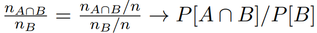
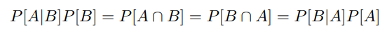
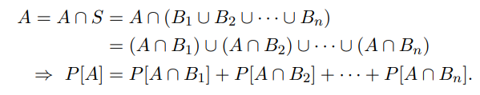
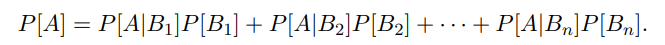
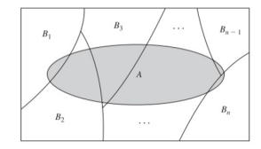
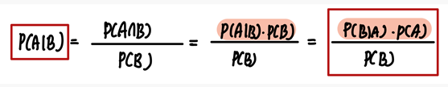
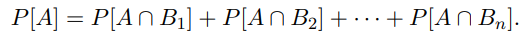
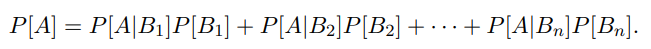

## Bayes theorem

`Bayes 정리를 이해하기 위해서는 다음의 순서대로 차근차근 이해해야한다.`

      1. 확률 
      2. 조건부 확률
      3. 분할과 전확률 정리
      4. 베이즈 정리
      5. 독립사건
      

- 참고       

1. 강화학습 강의자료   
2. [참고 링크](https://junpyopark.github.io/bayes/)      

---

 

#### Probability notation 

- `Outcome or Sample Point`

        다른 결과들로 더 쪼개지지 않는 결과 (head or tail! no more!)

 

- `Sample Space`

        나올 수 있는 모든 Sample Point들의 집합 

    `Sample Space`은 1. 유한하거나 2. 셀 수 있도록 무한하거나 3. 셀수 없이 무한한 집합이다.
 
        discrete Sample Space : 셀 수 있는 무한 집합 (정수의 집합)
        continuous Sample Space : 셀 수 없는 무한 집합 (실수의 집합)

         
        
- `Event`

        Sample Space의 부분 집합

 

- `Probability` 

        Event set(E) / Sample Space = P[E]

        ( 해당 사건 / 전체 사건 )

---

 

#### 조건부 확률 (Conditional Probability)

`조건부 확률`은 사건 B가 일어났을 때, 사건 A가 일어날 확률이다.

        예를 들어 오늘 비가 왔을 때, 내일도 비가 올 확률과 같은 것
        
 

  

`P(A|B)` : 사건 A의 확률 given that 사건 B

`* P(A|B)는 Sample Space를 S에서 B로 제한시킨다.` 

    분모는 우리가 어떤 확률을 논할 때, 사건의 전체 수를 놓는 자리이다.

    예를 들어 문이 100개 중 1개가 열려있다면, 문이 열려있을 확률은 1 / 100이다. 

    분모에는 Sample Space의 수인 100이 위치한다.

    하지만 조건부 확률의 분모는 Subspace이 위치한다. 즉, 제한된 경우의 수 위에서 논하게 된다는 뜻이다.

 

다음 수식을 보자.

    B가 일어난 경우의 수 중에서 A와 B 사건이 동시에 일어난 경우의 수를 나타낸다.
    
    이를 전체 경우의 수인 n으로 분모, 분자를 모두 나누면 확률적 표현으로 바꿀 수 있다.
    

  

 

반대로 사건 A가 일어났을 때 , 사건 B가 일어날 확률은 다음과 같다.

 

  

`위의 두 식에 간단한 곱셈을 적용해보면 관계가 드러난다!`

 

아래 식은 단순해 보이고 별 의미 없어 보이지만 `굉~장히 큰 의미를 가진 식이다.`

    

  

---

 

#### 분할 그리고 전확률 정리

 

- `분할 : Partition`

K개의 `집합 B1, B2 , ... , Bk`가 어떤 집합 S의 `분할`이 되려면 아래의 `두 가지 조건`을 만족해야 한다.
  
      1. B1, B2, ... Bk는 각각 서로소 여야한다. (서로 독립)  

      2. B1, B2, ... Bk 총 K개의 집합을 합집합 하였을 때, 그 집합은 정확히 S가 되어야한다.  

 
  

  
집합 A1, A2, A3, A4는 각각 서로소이고, 합집합을 했을 때 전체 집합인 A가 되므로 집합 A의 분할이다 ~  
  

  

 

- `전확률 정리 : theorem on total probability`

`B1,B2, ... , Bn` 이 `집합 S의 분할`이라고 하자.

그 때 `어떤 사건 집합 A`는 `서로 독립인 사건들의 교집합들`로 표현될 수 있다.

또한 위 식을 조건부 확률을 이용해서 전개하면 다음과 같이 표현할 수 있다.

다음의 그림을 보며 이해하면 훨씬 쉽다. 

---

 

  
#### 베이즈 정리 

 

`베이즈 정리`는 언뜻 `조건부 확률`과 모양이 비슷해보인다.

당연하다. 위 식은 `조건부 확률로부터 유도된 것`이기 때문이다.

 

`proof`

`Ok?`

 

`베이즈 정리`는 다음과 같은 상황에 잘 사용한다.

        P(A | B)는 구하기 어려운데 ...  P(B | A)는 구하기 쉽다!  (추론에 매우매우 많이 사용된다.)

 

`용어`

            P(A)   : A의 사전 확률      
            P(B)   : B의 사전 확률      
            P(A|B) : 사후 확률      
            P(B|A) : 우도 (Likelihood)  --- 보통 알려져있다고 가정한다.

`우리는 우도와 나머지 정보를 이용해서 사후 확률을 추론한다.`

 

`베이즈 정리 식`의 분모를 `전확률 정리`를 이용해서 전개하면 다음과 같다.

       

  
   

---  

 

#### 예시 1 

`문제`

    100개의 문 중 1개의 문만 열려있다. 센서를 가진 로봇이 지나다니며 문이 열렸는지 (1) 닫혔는지 (0) 확인한다.

        문이 열려있는 사건 : A 사건
        로봇의 센서 값이 1 (open) 인 사건 : B 사건 

    P[B|A] = 0.8 , P[B|A_c] = 0.1 일 때, 

    센서가 1이라고 측정하였을 때, 문이 열려있을 확률 P(A|B)는 ?

 

`Sol`

우선 위 문제를 잘 생각해보자.

문이 열렸을 때 센서가 1로 측정하는지, 0으로 측정하는 지에 대한 확률은 비교적 확인하기 쉽다. `P[B|A] , P[B|A_c]`

    열려 있는 문에 센서를 대보면서 몇 번 0이 나오는지, 1이 나오는 지 보면 된다.

반면에 센서가 측정하였을 때, 문이 열려있는 지 닫혀있는 지에 대한 확률은 상대적으로 확인하기 어렵다. `P[A|B]`

 

    이 문제는 `P[B|A] , P[B|A_c]` 정보를 알고 있는 상황에서 `P[A|B]`를 물어본다.
    이럴 때 `베이즈 정리`를 사용한다.

우선 다음의 `베이즈 정리`를 사용하기 위해 `P(A)`, `P(B)` 확률을 구해야한다.

    P(A) = 0.01 ( 열린 문 / 전체 문)

    P(B) = P(B ∩ A) + P(B ∩ A_c) = P(B|A)P(A) + P(B|A_c)P(A_c) (전확률 정리) = 0.107 

따라서 `P(A|B) = ( 0.8 x 0.01 ) / 0.107, 약 7%이다.` 

---

 

  

#### 예시 2
  
어떤 주식이 그 날 오를 확률이 θ라고 하자.  
  
이전의 주가 분석 정보들을 통해, θ가 0.4일 확률이 50% θ가 0.6일 확률이 50%임을 발견했다. (사전 확률 또는 사전 정보) 

이를 식으로 표현하면 다음과 같다.
  

  
  

  

  
  
이제 또 다른 데이터 분석을 통해 θ가 결정된 후 주가가 3일 연속으로 상승할 확률이 θxθxθ 임을 또 발견했다. (우도)

그렇다면 이제 문제다.
  
주가가 3일 연속 상승하였을 때, θ값이 0.6였을 확률은 얼마일까? (주가가 3일 연속 오른 사건을 A라고 하자.)
  
        엥? θ = 0.6 일 확률은 50% 라며? .. 일단 진행해보자!
  
우선 우리가 구해야 하는 확률은 P(θ = 0.6 | A )이며, 이를 베이즈 정리로 다음과 같이 구할 수 있다.   

  
  

  

  
  
여기서 결과적으로 구하게 된 확률인 0.7714 라는 수치가 **사후 확률**이다.  
  
      사후 확률은 추가된 정보로부터 사전 정보를 새롭게 수정한 확률이다.

   
  
우리가 사전에는 θ가 0.6일 확률이 50%. 즉 0.5임을 확인하였으나, 새로운 정보가 추가됨에 따라 이 정보가 0.7714 라는 수치로 변화하였다.
  
**이처럼 베이즈 정리는 새로운 정보에 대해 어떻게 계산을 하고, 또 결과를 도출해 낼 수 있는 지를 알려주는 굉장히 좋은 도구이다.**

[예시 링크](http://solarisailab.com/archives/2614)    

---
      
 
      

#### 독립 사건

두 사건이 독립이라면 다음의 식이 성립한다.  
  

  

이를 사건이 n개가 있는 경우로 확장시키면 아래와 같이 나타내볼 수 있다. 

  

                       
어떠한 1 <= i_1 ... <= i_k <= n 에 대해서도 위 식을 만족시키면 사건 A1, A2 , ... , An 을 독립인 사건이라고 한다. 

(i_1, ... , i_k 라는 숫자는 1에서 n까지의 숫자중 임의의 k를 뽑은 인덱스)
                           
쉽게 말해서, n개의 사건 중 아무거나 k개 뽑아서 교집합한 확률이 각각 확률의 곱과 같다면 독립이라고 할 수 있다!      

 

`개념적으로 이해하기 어렵다면 단순히 계산을 때리면 된다.` 

        독립사건 : A , B 사건 교집합의 확률 == A 사건의 확률 x B 사건의 확률
        종속사건 : A , B 사건 교집합의 확률 != A 사건의 확률 x B 사건의 확률
                             

  
  

---

