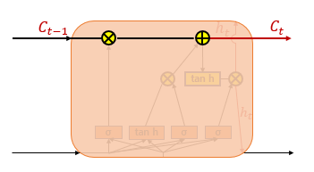
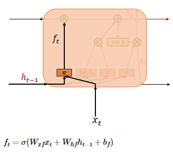

### LSTM

---

- `RNN architecture`

---

- `Long-Short Term Memory`

        problem of Long-Term dependency in RNN..

    RNN에 비해 조금 복잡하지만 뜯어보면 생각보다 간단하다.
    Cell에 입력 게이트, 망각 게이트, 출력 게이트를 추가했을 뿐 

 

`1. cell state`

    여기서 넘겨주는 Ct 값은 이전 cell에서 던져준 값과 입력 게이트, 망각 게이트에서 나온 값을 처리하여 얻게 된다.

    입력 게이트에서 구한 i,g 는 원소별 곲을 진행한다.
    즉, 같은 크기의 두 행렬이 있을 때, 같은 위치에 있는 원소끼리 곱셈을 수행 -> 이번에 기억될 정보
    
    이 정보는 삭제 게이트의 결과값과 더한다. 이 값이 Ct, 즉 다음 cell로 던져줄 cell state 출력값이다. 

 

    삭제 게이트와 입력 게이트의 영향력을 이해해보자.
        
    if, 삭제 게이트 f = 0?
    이전 cell state C(t-1)의 정보는 하나도 사용하지 않는다.
    따라서 오직 지금 들어온 입력 게이트의 결과만 다음 cell state로 전달된다. 

    if, 입력 게이트 i*g = 0?
    지금 들어온 정보는 다 버리고, 이전 cell state에서 넘겨준 정보만 다음 cell state로 던져준다. 

 

`2. 입력 게이트`

    입력 게이트는 현재 들어온 입력 정보를 기억하기 위한 게이트.
    sigmoid함수를 지나 0~1 사이의 값을 가지는 i 와 tanh를 지나 -1~1 사이의 값을 가지는 g가 생성

    이 두가지 값을 가지고 기억할 정보의 양을 정한다.  

    
 

`3. 망각 게이트`

    망각 게이트는 입력 게이트와는 반대로 지금 들어온 정보를 얼마나 삭제할 지를 정한다.
    현재 들어온 입력 x와 이전 hidden state 값인 h를 가지고 계산한 결과를 sigmoid 함수에 통과시키는데, 
    0에 가까울수록 많이 잊어버리고, 1에 가까울수록 정보를 싸그리 다 가지고 가겠다는 것.

 

`4. 출력 게이트`

    기존 rnn과 비슷한 구조를 가지고 있다. 다만, ht를 계산함에 있어서 이전 hidden unit에서 던져준 h(t-1) 뿐만 아니라,
    C(t-1)도 같이 고려해서 ht를 계산하고 다음 hidden unit에 던져준다.

 

`Another graphical representation`

