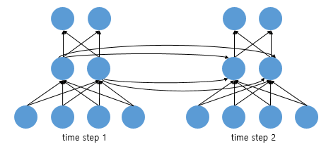
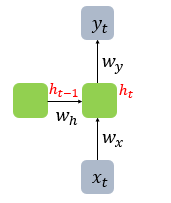
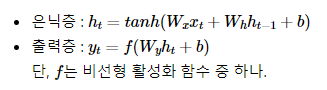

### RNN 

---

- `Recurrent Neural Network`

        이전 time step의 hidden unit이 현재 time stpe의 hidden unit에 영향을 준다. 
        마찬가지로 현재 hidden unit이 다음 time step의 hidden unit에 영향을 준다.

           * 나는 이 recurrent model을 이용해서 delayed control을 다루려고 한다.

 

        