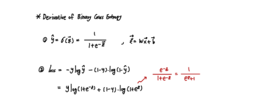
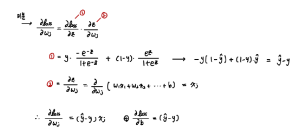
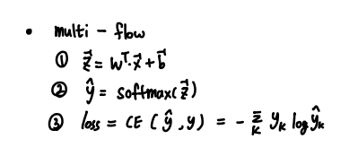
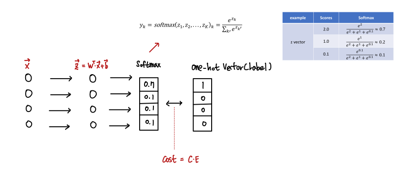
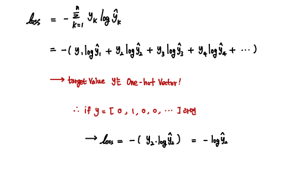

#### BCE / CE

Logistic Regression에서는 Linear Regression과 다르게 MSE Loss를 사용할 수 없다.

        Local Minima에 빠지기 쉽게 미분되기 때문

ML과 DL에서 가장 중요한 것은 미분이 가능한 Cost function을 사용하는 것이다.

`Logistic에서 사용하는 BCE`와 `Multi-Class Logistic에서 사용하는 CE를 정리해보자.`

 

- Activation function

        Binary : Sigmoid
        Multi- : Softmax

- BCE

BCE의 식은 다음과 같은 모양이다.

미분은 다음과 같이 진행된다.

따라서 Numerical 하게 SGD Update를 하려면 위 식을 이용하면 된다. 

- CE

Multi-class 학습 Flow

 

`Cross Entropy`

