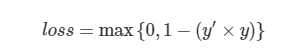
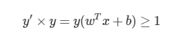
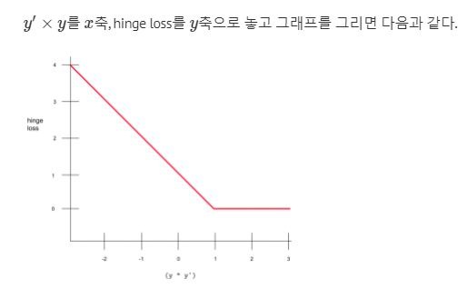

#### Hinge Loss

[참고 블로그](https://ratsgo.github.io/machine%20learning/2017/10/12/terms/)

Hinge Loss는 SVM에서 많이 사용하는 Cost function이다.

    학습데이터를 구분하면서 데이터와의 거리가 가장 먼 결정 경계를 찾기 위해 사용된 손실 함수!

    Label이 -1과 1로 주어질 때 사용한다.

Hinge Loss의 특징은 `틀린 것에 페널티를 주는 것 뿐만 아니라, Confidence없게 맞은 정답에도 페널티는 준다는 것!`

 

`Hinge loss`

SVM은 Plus 평면 보다 위에 있는 관측치들에 대해서는 y = 1이고, hypothesis는 1보다 크다.

또한 Minus 평면 보다 아래에 있는 관측치들에 대해서는 y = -1이고, hypothesis는 -1보다 작다.

따라서 손실 함수는 아래와 같이 정의된다.

        hypothesis * y 값이 1보다 크다면 loss는 0으로 여긴다.

        hypothesis * y 값이 1보다 작다면 작을수록 loss가 크다고 여긴다.

