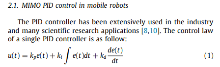
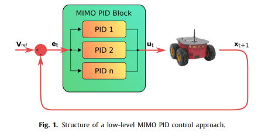
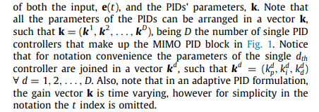

## An adaptive deep reinforcement learning approach for MIMO PID control of mobile robots `5 September 2019`

###`Abstract`

복잡한 역학 구조를 가진 Plant를 제어하기 위해 점점 더 지능화된 시스템이 사용된다.  
하지만 단순함에 의해 PID control method 또한 아직은 산업계 전반에서 넓게 사용되고 있다.  
해당 논문에서는 Mobile robot에 심층 강화학습 기반 PID control method을 제안한다.  
제안하는 Hybrid control method는 Actor-Critic 기반의 강화학습 알고리즘과 Low level의 역학 정보만을 입력으로 이용하고,  
동시에 PID 제어기의 다양한 파라미터와 Control gain을 추정한다. 

 

### `Introduction`

기존에는 여러 방법들을 통해서 PID Control gain을 Adaptive하게 변화시키는 방법을 사용했다.  
이 방법들은 대부분 특정한 가정을 기반으로 해야하고(Ex. Linear System), 상당히 정확한 Dynamic Model을 안다는 가정 하에 사용된다.  
하지만 실제로 로봇이 Unknown 환경에서 작업하는 일이 많기에 대부분의 경우 이러한 모델링은 매우 어렵다.

이 Adaptive Control을 위해 Fuzzy Logic이나 Genetic Logic과 같은 AI 기술들이 조금씩 등장했다.  
더 나아가 Multi layer Perceptron을 사용한 SVM모델을 이용한 Adaptive Control, Recurrent Neural Network를 이용한 Adaptive Control 방법들도 하나씩 등장한다.

하지만 Mobile Robot의 Payload가 변하거나, Robot Hand 앞에 놓인 물건의 위치나 주변 환경이 변하는 등의 변화가 있을 때는 Reinforcement learnig과 같이
주변 환경과 Interaction하며 On-line learning을 수행하는 알고리즘이 보다 합당하다고 생각된다.

처음에는 Q-learning을 이용한 fuzzy control을 이용하여 adaptive control을 수행하였다.  
하지만 Value function 또는 Q function에 대한 memory 문제가 있었다.    
이후 Deep RL이 점점 발전함에 따라 Continuous state space와 action space를 다룰 수 있는 Actor-Critic 알고리즘을 사용하게 된다.

`해당 논문에서는 Actor Critic 구조의 DDPG 알고리즘을 기반으로 mobile robot의 PID gain self-tuning을 위한 model-free goal-driven method을 제안한다.`

 

### `Problem formulation`

`Single PID 제어기에 대한 Error Dynamics`

PID 제어기 여러 개에 대한 Error Dynamics는 Matrix 형태로 구성

 

`MIMO PID Controller`

MIMO (Many Input Many Output)

 

Control gain vector `K`를 RL을 통해 얻는 것이 목표.

`State  : X`  
`Action : K`  
`Reward : R`  
`Policy : Pi`

 

 

