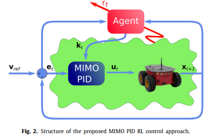
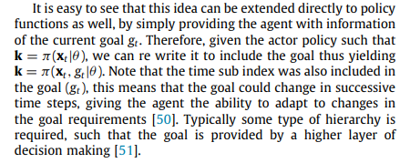
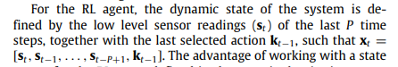
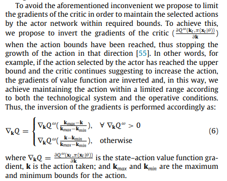
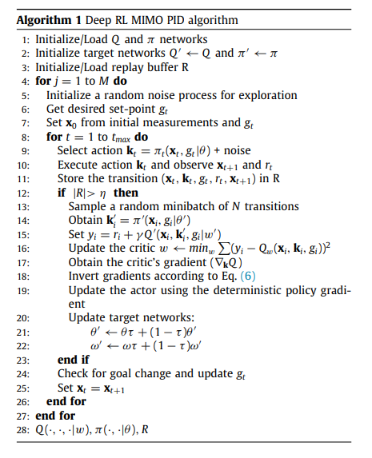
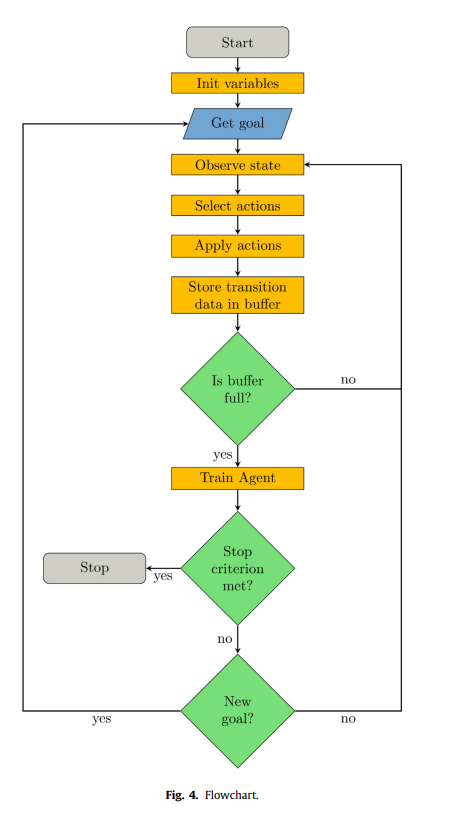
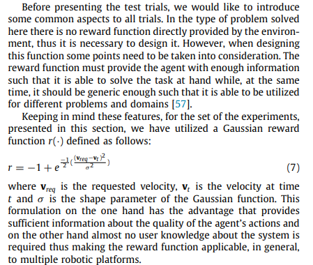
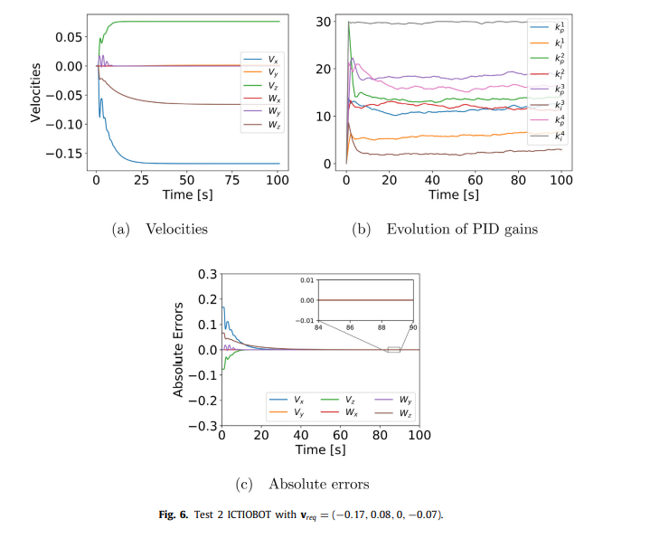

## An adaptive deep reinforcement learning approach for MIMO PID control of mobile robots `5 September 2019`

###`Abstract`

    단순함에 의해 PID control method 또한 아직은 산업계 전반에서 넓게 사용되고 있다.  
    해당 논문에서는 Mobile robot에 심층 강화학습 기반 PID control method을 제안한다.  
    제안하는 Hybrid control method는 Actor-Critic 기반의 강화학습 알고리즘과 low-level의 역학 정보만을 입력으로 이용하고,  
    이를 통해 PID 제어기의 다양한 파라미터와 Control gain을 추정한다. 

 

### `Introduction`

    고전적인 PID Control Method는 널리 쓰이긴 하지만, Dynamic Model을 정확히 알아야하는 것이 단점이다.  
    하지만 고전적인 PID Control로는 구조체의 물성치나, 주변 환경이 변화할 때 이에 능동적으로 대처하지 못한다.   
    이를 위해 PID Control gain을 Adaptive하게 변화시키는 방법을 사용했다.

    이 방법들은 대부분 특정한 가정을 기반으로 해야하고(Ex. Linear System), 비교적 정확한 Dynamic Model을 알고 있어야 한다.     
    하지만 실제로 로봇이 Unknown 환경에서 작업하는 일이 많기에 대부분의 경우 이러한 모델링은 매우 어렵다.   

    보다 고차원적인 Adaptive Control을 위해 Fuzzy Logic이나 Genetic Logic과 같은 기술들이 제안되었다.    
    더 나아가 MLP 구조의 SVM 그리고 RNN을 이용한 AI 기반 Adaptive Control들도 제안되었다. 

    하지만 Mobile Robot의 Payload가 변하거나, Robot Arm의 End Effector 앞에 놓인 물건의 위치 등의 환경의 변화가 있을 때는 
    Reinforcement learnig과 같이 주변 환경과 Interaction하며 On-line learning을 수행하는 알고리즘이 보다 합당하다고 생각된다.

    처음에는 Q-Learning을 기반으로한 fuzzy Control을 이용하여 Adaptive Control을 수행하였다.
    하지만 Value function과 Q function을 tabular 형태로 만들어 사용해야하는 한계점 때문에 환경적 제약이 컸고, 성능도 뛰어나지 않았다.

    이제 점점 Deep RL이 발전함에 따라 Continuous Space를 다룰 수 있는 알고리즘이 등장하였기에,
    해당 논문에서는 Actor Critic를 기반으로 mobile robot의 PID gain을 self-tuning하기 위한 model-free goal-driven method을 제안한다.

 

### `Problem formulation`

`Single PID 제어기에 대한 Error Dynamics`

 

`MIMO PID Controller`

`MIMO (Many Input Many Output)`

`Error Dynamics는 Matrix 형태로 구성`

 

Control gain vector `K`를 RL을 통해 얻는 것이 목표.

`State  : X`  
`Action : K`  
`Reward : R`  
`Policy : Pi`

 

    하지만 위의 단순한 MIMO PID Controller 구조로는 Real-time으로 변화하는 환경에 대해 잘 대응하지 못한다.

    예를 들어, 

    특정 Goal에 도달했을 때 1의 Reward를 받고, 도달하기 전까지는 Reward가 없다고 해보자.
    이런 경우 Goal이 고정되어있다면, 빠른 속도로 Goal에 도달하고 Reward를 받을 수 있다 .

    하지만 만약 Goal이 Real Time으로 변하게 되면, 해당 Episode를 수행하고 있는 Robot은 바뀐 Goal 지점을 알지 못하고, 
    이전에 알고 있던 Goal에 도달하여도 Reward를 받지 못한다.
    
    
    따라서, 다음과 같이 Agent에게 Real time으로 Goal을 알려주는 구조로 변형한다.

 

`Action K는 이제 State X와 더불어 time t에서의 Goal g_t를 포함한 함수로 변형된다.`

 

State X는 Sensor data의 Sequence와 바로 K_t-1 Action의 Array이다.  
즉, 연속적으로 변화하는 Sensor 값들을 일정 Sequence 길이로 받아 State로 사용한다.  

    Reinforcement learning 기반으로 Gain을 찾을 때, limitation이 필요하다. 
    이는 HW Specification에 따라 Stability를 유지하는 선에서 감당가능한 Gain 값들만을 이용하기 위함이다.

    예를 들어, Kp, Ki, Kd 값들은 0보다 커야하며 HW Spec에서 제한하는 값보다는 작아야한다. 
    이를 위해 Inversion of the gradients를 사용한다.

    Inversion of the Gradient는 특정 Gain 값이 우리가 정한 상계에 다다랐음에도 불구하고, 증가하는 방향으로 업데이트 되려하면,
    이를 상쇄시켜 해당 값에 머무를 수 있도록 해주는 일종의 안전 장치로 작용한다.

 

- `Deep RL MIMO PID algorithm` 

Reward function은 해당 환경에 유동적이게 하기위해 Gaussian reward function을 사용한다.  

- `Result`

