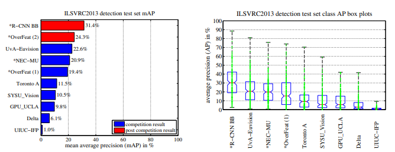
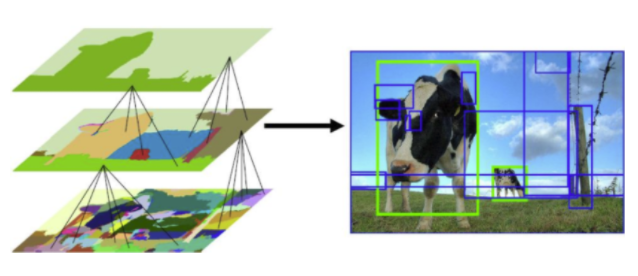
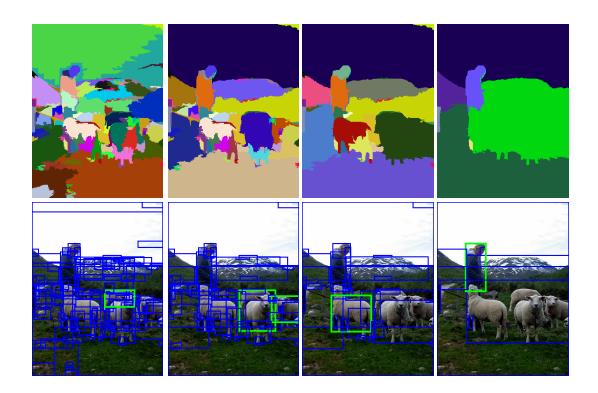
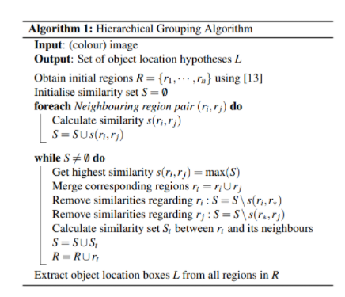
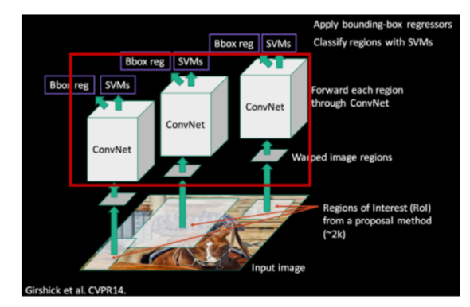
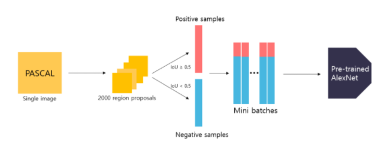
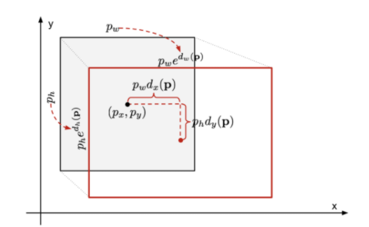
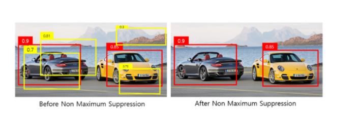

### Rich feature hierarchies for accurate object detection and semantic segmentation `22 Oct 2014`

`2 - Stage detector의 시초인 R-CNN에 대한 논문 `

`CNN`과 `Region Proposal method`를 결합시킨 모델이며, `R-CNN` 이라고 명명

 

 

#### `Abstract`

- 해당 논문의 방법으로 지난 2012년의 최고 성능에 대해 mAP 지표로 30% 이상의 성능 향상을 이뤄냈으며, 두 가지 방법에 초점을 맞추었다.  

      1.localize와 segmentation을 위해 bottom-up 방식의 region proposal 방법을 CNN에 결합시켰다. 
      2.Labeling된 data의 부족을 해결하기 위해 auxiliary task로 supervised fine-tuning을 진행한 후 ,
        domain-specific한 dataset으로 fine-tuning을 진행하였다.

- mAP : mean Average Precision

[mAP](https://github.com/dldnxks12/A.I/tree/master/%ED%8F%89%EA%B0%80%EC%A7%80%ED%91%9C)

 
      
- Overfeat 모델과 비교 진행하며 발전시킨 알고리즘이며, Overfeat 모델 보다 성능이 뛰어나다.    

      Overfeat : CNN 구조를 사용하며 Sliding-Window 방법으로 detection을 수행하는 모델이며 R-CNN 비슷한 컨셉

    

---

 

 

#### `Introduction `

- 이 논문은 CNN을 사용해서 object detection 성능을 극적으로 높인 최초의 논문이다.

      이전에는 HOG 또는 SIFT와 같은 느리고 복잡한 알고리즘을 통해 Object detection을 수행했다.

      (HOG , SIFT : Computer Vision Alogorithm)

 

- 두 가지에 초점을 맞추어 알고리즘을 발전시켰다.

      1. Deep Network를 이용하여 Localization을 수행하는 방법
      2. 작은 양의 Annotated detection data를 이용하여 High-Capacity 모델을 학습시키는 방법
         - 즉, 작은 양의 label data를 가지고 무거운 모델을 학습시키는 방법 
      

 

- Overfeat 등과 같이 sliding-window detector와 비슷하게 우리도 sliding-window를 사용하려고 했다.

      sliding-window detector은 제한된 수의 물체만 감지하고, 고해상도를 유지하기 위해 2개의 Conv layer와 1개의 pool layer만 사용한다. 
      R-CNN은 5개의 Conv Layer와 Pool layer, 그리고 더 큰 Receptive Field와 Stride를 사용하기에 해당 방법은 부적합하다. 
      
       
      
- sliding-window 대신 `recognition using regions` 방법을 사용한다.

      test에서 하나의 입력 이미지에 대해 2000개의 region을 뽑아냈고, 이를 SVM을 이용해서 모두 분류했다.
        - 즉, 각각의 region에 대해서 해당 region이 어떤 물체를 가지고 있는지를 분류
      
      당연히 2000개의 region을 무작위로 뽑는 것이 아니라 Selective Search 라고 하는 알고리즘을 이용한다.

 

- 부족한 데이터를 처리하는 방법

      Supervised pre-training on a large auxiliary dataset 이후 작은 dataset에 대해 domain-specific fine-tuning 수행

      즉, 큰 양의 데이터를 가지고 보조 학습을 진행하고, 이후 우리가 학습시키려는 Specific한 영역의 데이터로 fine-tuning 

---

 

 

#### `Object detection with R-CNN`

- 3개의 모듈로 구성된 모델이다.

      1. Module for Generating Category-indepenent region proposals
      2. Module for a large CNN 
      3. Moudle for classifying regions with SVM 

 

  

  

 

- `Region proposals Module`

      objectness, selective search, category-indepent object proposals, .. 등의 방법 중 selective search 방법 사용

`Selective Search`

이미지 구조를 이용해서 객체를 찾는 Segmentation과 모든 객체의 위치를 찾는 Exhaustive Search 두 가지 방법을 적절히 사용해서 후보 영역을 추천한다.

      
1. Capture All Scales : 이미지 내의 물체의 크기는 랜덤하므로, 모든 크기를 고려한다.
2. Diversification : 영역들을 그룹화하는데 있어 최적화된 단일 전략은 없으므로, 색상, 재질, 크기 등 다양한 조건을 고려해야한다.
3. Fast to Compure : Model 내에서 동작하는 알고리즘이므로, 병목현상이 없도록 빨라야한다.

 

`Pseudo Code of Selective Search algorithm`
      

      1. 가장 유사도가 높은 영역 i와 j 선택
      2. 선택된 영역을 t로 병합
      3. i와 j가 연관된 다른 유사도 집합들을 제거 
      4. 병합된 t영역과 나머지 영역들간의 유사도를 다시 정의
      5. 새로운 유사도 집합에 지금 합쳐진 영역을 추가
      6. 영역들이 더이상 다른 영역과 병합되지 않을 때 까지 반복

      * 유사도 : 색상, 재질, 크기, 채워진 정도 들의 가중합으로 결정 

 

위의 Selective Search를 통해 region들을 얻은 후 CNN에 넣어주기 위해 이미지를 Wrapping시킨다. (277 x 277)

    CNN은 고정된 크기의 이미지를 요구하기 때문이다.

 

- `CNN Module`

` fine-tuning`

CNN 구조로는 AlexNet 구조를 사용한다. AlexNet은 많은 양을 가진 데이터를 사용해서 fine-tuning을 시켜놓는다.

이후 우리가 사용하려는 데이터셋을 사용해서 tuning을 진행한다. 

2000장의 region proposals와 ground-truth box의 IoU를 비교해서 0.5보다 클 경우 Positive Sample, 아닐 경우 Negative Sample로 나눈다.

이렇게 Sample을 나누어 학습을 진행하면 30배 더 많은 학습 데이터를 이용하는 셈이 된다. 

학습 과정에서 Positive Sample 32개 + Negative Sample 96개 = 128개의 이미지로 이루어진 미니 배치를 만든다.

배경 label을 추가하기 위해 기존의 AlexNet의 마지막 Softmax layer에 1개 Node를 더 추가해준다.

이렇게 모델을 학습시킨 후, 실제 R-CNN 모델에는 마지막 Softmax layer를 떼어내서 사용한다.

CNN Module에서 최종적으로 나오는 값이 분류된 값이 아니라 4096 개로 펼쳐진 feature vector를 추출하는 것이기 때문이다. 

 

`Domain-Specific fine-tuning`

모델의 사전 학습이후, 실제로 데이터를 넣어 학습할 때에는 IoU가 0.7이상일 때만 Positive Sample로 분류한다. 

4096개의 feature vector가 추출되면 이를 Linear SVM을 이용해서 학습한다.

SVM이 이진 분류를 하기 때문에 분류하려는 객체의 종류만큼 SVM이 필요하다.

한 차례의 학습이 끝나면, hard negative mining 기법을 사용해서 다시 학습을 수행한다.

SVM에서는 출력으로 객체의 Class와 Confidence Score를 낸다.

    R-CNN에서는 N-way softmax layer가 아니라, SVMs를 이용해 분류를 한다. 
    
    SVM을 사용했을 때 성능이 더 좋기 때문이다.

      

      

      

 

- `Hard negative mining`

이미지에서 우리가 원하는 객체를 탐지한 경우 해당 Region은 Positive Sample이 되고, 그 외는 배경과 같이 Negative Sample이 된다.  
이 때, 객체에 비해 배경의 비율이 압도적으로 높다.  

따라서 이미지가 아닌 부분을 Positive Sample이라고 하는 경우 보다, 배경을 Positive Sample이라고 분류하는 경우가 상대적으로 많게 된다.  
즉, False Negative의 비율이 훨씬 많아진다. 

이 문제를 해결하기 위해 SVM의 학습과정에서 매 Epoch마다 False Positive Sample들을 학습 데이터에 추가해준다.  
이를 통해서 모델이 조금 더 Robust해지고, False Positive 오류가 줄어든다.

 

- `Bounding Box Regressor`

Selective Search 알고리즘을 통해서 얻은 객체의 위치가 부정확할 수 있다.

Bounding Box는 이 부정확한 객체의 위치를 조정해주는 알고리즘이다.

 

- `Non Maximum Supression`

R-CNN을 통해 얻는 2000개의 region 또는 bounding box를 다 표현하면 bounding box들이 매우 많이 겹치게 된다.

따라서 가장 적절한 bounding bolx를 선택하는 알고리즘이 필요하다.

      1. Bounding Box별로 SVM에서 출력한 Confidence Score를 보고 특정 threshold 이하의 box를 제거한다.
      2. 남아있는 Bounding Box를 Confidence Score의 내림차순으로 정렬한다.
      3. Bounding Box가 높은 순서대로 하나씩 다른 Bounding Box와의 IoU를 조사해서 IoU가 특정 값이상 인 경우 모두 제거한다.
      4. 3의 과정을 반복해서 남아있는 Box만 취한다. 

- 참고 자료 및 블로그

[blog](https://velog.io/@skhim520/R-CNN-%EB%85%BC%EB%AC%B8-%EB%A6%AC%EB%B7%B0)

[paper](https://openaccess.thecvf.com/content_iccv_2015/html/Girshick_Fast_R-CNN_ICCV_2015_paper.html)
