## Selective Search for Object detection `2013`

[Paper](http://www.huppelen.nl/publications/selectiveSearchDraft.pdf)

해당 논문은 Object Recognition에서 사용하기 위한, Object의 위치를 포착하는 문제를 다룬다.

 

### Abstract & Introduction 

SS는 `Exhaustive Search` 와 `Segmentation`의 강점을 모은 알고리즘이다.

        Exhaustive Search : Input 이미지의 가능성 있는 모든 곳을 하나씩 다 찾는 방법
        Segmentation : 이미지를 Pixel 단위로 모두 Classification 

 

기존의 윤곽선을 찾아내서 Object를 찾는 알고리즘은 형편없었다.

그 이유로는 대부분의 객체들이 계층적인 구조로 이루어져있기 때문인데, 아래의 그림을 보면 이해할 수 있다.

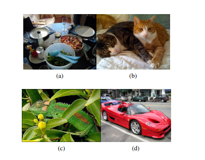

a) 그림은 그릇이라는 객체 내부에 숟가락이라는 객체가 포함되어 있다.   
b) 그림은 같은 고양이지만, 구분되는 기준에 따라 다르다. texture에 따른 기준과 색에 따른 기준 등..  
c) 도 마찬가지로 색 기준과 texture 기준에 따라 구분되는 객체가 다르다.  
d) 그림은 타이어와 자동차는 다른 texture와 다른 color를 가지지만 같은 객체로 묶여야한다. 

이제 기존에 방법과는 다르게 계층적인 의미를 담고 있는 다양한 Scale의 객체를 잘 구분해낼 수 있는 다른 방법이 필요하다.  
이를 해결하기 위해 `Exhausitive Search` 알고리즘이 등장했는데, 연산량이 매우 크다는 점과 고정된 크기와 하나의 기준으로만 구별할 수 있다는 것이 문제다.

 

SS는 다음과 같이 두 가지 기존 알고리즘의 장점을 사용할 것이다. 그리고 3의 방법을 추가한다.

1. Segmentation과 같이 Object를 Sampling할 때 이미지의 구조를 사용할 것
2. Exhaustive Search와 같이 가능한 모든 Object의 위치를 찾을 것
3. Data-Driven 기준을 통해 다양하게 Search를 할 것 

3의 방법을 통해, 하나의 기준으로 Object를 찾지 않고, 여러 가지 기준을 적용하여 가능한 모든 객체들을 찾아낸다. 

        즉, Segmentation을 통해서는 구조적인 부분을 탐지하고 Exhaustive Search를 통해 가능한 모든 객체를 탐지한다.
        하지만 이제 기존의 하나의 기준으로 Sampling하던 것에서 벗어나 Data에 따른 여러 기준을 주어 객체들을 탐지할 것이다. 

        최종적으로 객체의 Localization은 위의 여러 기준을 고려하여 탐지된 객체들을 종합적으로 고려해서 결정한다. 

SS는 적은 양의 data로 class에 독립적이며 총 10097개의 위치에 대해 `0.99의 recall`과 `0.879의 IOU`의 질 좋은 결과를 얻었다.

---

 

### Exhaustive Search & Segmentation
 

- Exhaustive Search 

객체는 어느 위치에든, 어떤 크기로든 존재할 수 있기 때문에 모든 곳을 찾아보는게 당연하다.   
하지만 그렇다면 찾아봐야하는 Search Space가 너무 크고 Exahustive Search의 연산이 매우 무거워진다. 

따라서 대부분의 이런 Sliding Window 방법은 Coarse Search Grid와 고정된 크기 (aspect ratio : 가로세로 비율)를 사용한다. 

    SVM과 HOG와 같이 연산이 가벼운 분류기들을 사용했다. 

물론 이렇게 끝이 아니라, Cascade하게 분류기들을 달아 문제를 해결한다. 하지만 위에서 언급했 듯, 계층적인 의미를 가진 객체는 탐지하지 못했다.    
위의 연산량과 고정된 크기로 Searching하는 문제를 해결하기 위한 방법이 여럿 있었으나 두 가지 문제를 효과적으로 다 잡지는 못했다.

 

그럼 이제 Blind Exhaustive Search 대신 Selective Search를 사용하자.

        Blind ~ 라고 말한 이유는 아마 계층적으로 구별하지 못하고, 하나의 기준에 대해서만 Searching 하는 문제를 비꼰 것 같다.

Selective Search는 객체의 localization을 위해 (Segmentation을 통해)이미 구해놓은 이미지 구조를 사용한다.  
기존의 Fixed Scale로 객체들을 탐지하던 방법과 달리 이렇게 Segmentation을 통해 구한 구조에서 시작하기 때문에 매우 다양한 Scale에 대한 탐지가 가능하다.

    예를 들면 잔디나 모래와 같은 것까지!

하지만 궁극적으로 우리는 더 Exhaustive Search보다 더 적게 객체를 탐지해내려고 한다.  
물론 더 확실한 Object들이며, 이를 통해 연산을 줄이고 다른 ML모델에 사용하기 편하도록 만들기 위함이다.

 

- Segmentation

Class에 독립적으로 객체들을 탐지하기 위해 Segmentation을 사용하는 방법들이 나타났다.
Background와 Foreground Segment들을 여러 개 만들고 이 foreground가 Complete Object가 될 확률을 높이도록 학습하는 방법인데,   
이 방법은 이미지 내에서 객체들을 분리해내는 데 굉장히 좋은 성능을 보이며 가능성 높은 Region을 탐지하는 데에 강력한 알고리즘이다.  
이 방법들은 초기에 Random하게 많은 bg / fg를 선택하고 차근차근 학습해나가는 방법을 사용한다.  

하지만 우리 방법은 초기에 특정한 기준들을 사용해서 굉장히 명확하게 Region들을 선택해나간다.
더욱이 SS 알고리즘에서 더 흥미로운 점은 `여러 가지 조건으로 포착한 Region들을 서로 비교하는 것이 아니라, 서로 Complement 할 수 있다는 것이다.` 

 

가장 먼저 Segmentation을 신경 써서 수행하고, 이 결과를 바탕으로 Object들을 찾아나갈 것이다.  
기존 방법은 하나의 기준 feature를 통해 Segmentation을 수행했지만, 본 논문에서는 여러 가지 data-driven 기준을 사용할 것이다.

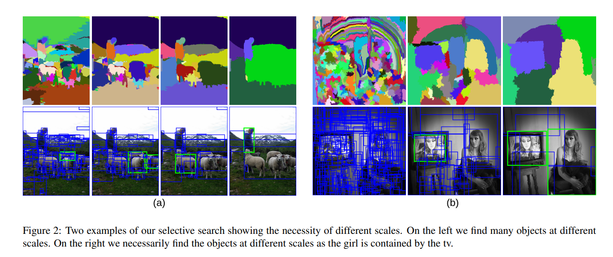

왼쪽 그림을 보면 먼저 이미지 내에서 fg와 bg를 나누는 것을 볼 수 있다.
그리고 점차 fg가 complete한 객체가 되도록 학습하는 모습을 볼 수 있다.

`이 방법으로 기존 Exhaustive Search의 방법에서 벗어나 다양한 Scale에 대해 Object Localization을 수행할 수 있다.` 

다음으로는 FG로 segmentation된 결과들 중에서 실제 객체를 포함하고 있는 FG를 탐지하는 것을 볼 수 있다.  

 

### Selective Search 

`Design Considerations` 

- Capture All Scales
- Diversifictaion
- Fast to Compute 

---

1. Capture All Scales

    이미지 내에서 물체의 크기는 각기 다르고 어떤 객체는 그 경계가 불명확하다. 따라서 객체의 Scale을 고려한다.

2. Diversification 

    
    Object를 포함하고 있을 가능성이 있는 Region을 찾는 데에는 최적화된 단일 방법은 없다.   
    따라서 Texture, color, Scale 등의 다양한 조건을 고려한다.

3. Fast to Compute

    실제로 이러한 알고리즘을 ML 모델 내부에서 사용할 수 있도록 설계하기 위해서 병목현상을 유발하지 않도록 가볍게 만든다. 

 

- Selective Search by Hierarchical Grouping Algorithm 

SS는 계층적인 Object Grouping을 위한 알고리즘을 사용한다.    
따라서 먼저 모든 Scale의 Region들을 살피고 마지막으로 이미지 전체를 살피도록 하기 위해 Bottom Up 방식으로 Segmentation을 수행한다.  
또한 Pixel base feature 보다는 Region base feature가 더 많은 정보를 담고 있으므로 가능한 항상 region base feature를 사용한다. 

`Grouping Algorithm`은 다음과 같다. 

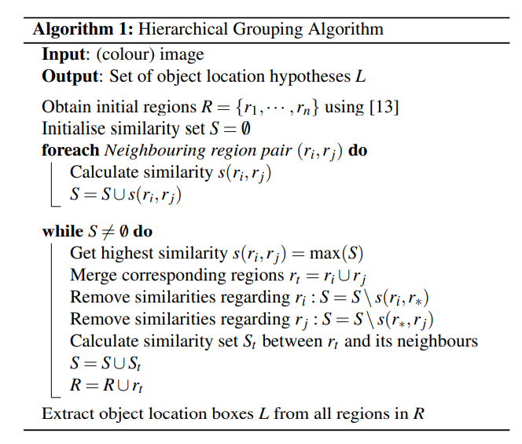

1. Efficient Graph-Based Image Segmetantion method를 따라 초기 region들을 만든다.
2. 이후로는 Greedy Algorithm으로 Iterative하게 Region들을 Group화 한다. (그 때 그 때 가장 좋은 결과를 선택)

    가장 먼저 두 이웃한 Region간의 유사도를 계산한다. 그리고 특정 threshold 이상의 값을 가질 경우 두 region을 group화 한다.
    다음 Iteration에서는 이 Group화된 region과 이웃한 region들 과의 유사도를 비교하여 group화를 수행한다.

    더이상 Group화가 진행되지 않을 때 까지 반복한다.

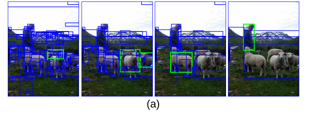

 

- Diversification Strategies

SS는 다양한 기준으로 Sampling하고, 이 Sample들을 서로 Complement하게 사용한다.   

1. 다양한 Color Space 
2. 다양한 유사도 측정 method 
3. 다양한 Starting Region

위 방법들을 통해 다양화 조건을 만족시킨다.

`Color Channel`

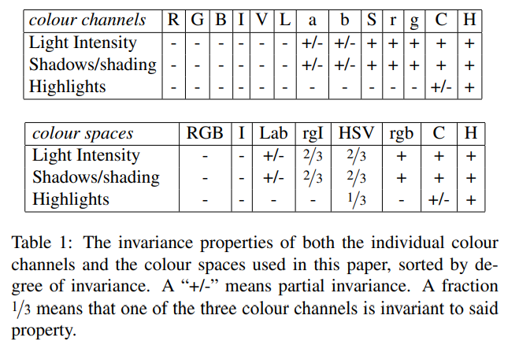

`Similarity with Color`

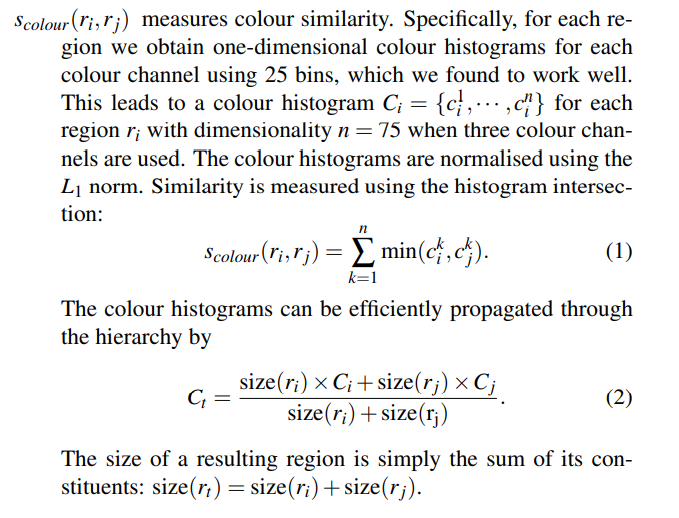

`Similarity with Texture`

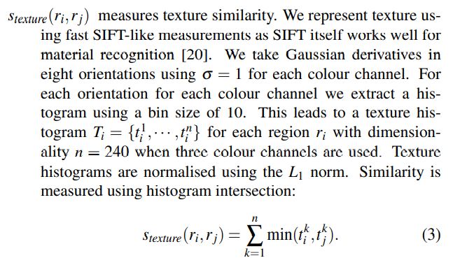

`Similarity with Size or Scale`

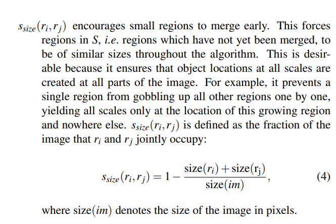

`Similarity with Fill (Overlapped)`

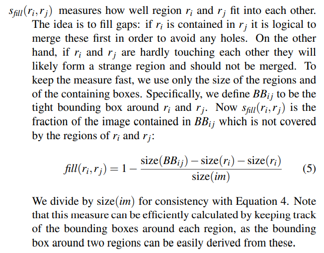

`Mixture Method`

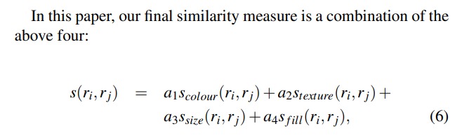

본 논문에서는 Mixture Method를 사용해서 유사도를 측정했다.

Complementary Starting Regions에 대해서는 동일하게 Efficient Graph-Based Image Segmetantion method를 사용하나  
OverSegmentation과 같은 방법으로 초기 region의 변화를 주었다. 

 

### Combining Locations 
 
Hierachical Algorithm을 통해서 얻은 여러가지 가설 객체들 (Object hypotheses)를 결합하는 과정이다.

    한 region안에서 계층적으로 존재하는 여러 객체들을 탐지해냈고, 이 객체들의 포함관계를 규명하는 과정으로 보인다. 

이상적으로는 가장 앞에, 가장 먼저 나오는 객체의 순서로 가설 객체들을 Ordering하고 싶었지만, 연산 효율성과 추가적인 feature Extraction과 Classification의 필요성의 문제가 있었다.

다른 해결책으로 각 Grouping 전략에서 가장 먼저 group화 된 객체의 순서로 포함 관계 (계층관계)를 정의하기로 한다. 
하지만 여기서도 총 80개의 전략으로 group화를 수행했기 때문에 연산량이 만만찮다. 

따라서 Random성을 가해 80개의 전략에서 random하게 전략 j를 선택하고, 이 전략에서 가장 먼저 그룹화된 객체 i를 최상위 객체로 정의한다. 

 

### Object Recognition using Selective Search  ---------------- 다시  

본 논문에서는 SS를 통해 얻은 Region들을 Object Recognition에 사용한다. 

Object Recognition에는 주로 HOG와 BOW를 사용하는데 , SS는 다양한 color에 대한 SIFT discriptor를 차용한 BOW를 사용한다. 

        HOG : Histogram of Oriented Gradients
        BOW : Bag of Words

        SIFT : 추출한 Feature를 Vector로써 표현하는 방법 - SIFT는 Scale과 Rotation에 강인하게 만들어진 알고리즘  

구체적으로는 특정 scale에 대해 각 region에서 SIFT를 통해 feature extraction을 수행하고 다른 Scale에 대해서도 동일하게 반복한다.  
결과적으로 360,000 길이의 total feature vector를 추출할 수 있고, 이를 우리가 원하는 Object와 BOW를 통한 유사도를 측정한다.

유사도를 측정한 후 Classifier로는 BOW에 대해 좋은 성능을 보인다고 알려진 SVM을 사용한다.

 

SVN의 traninig 과정은 다음과 같다.

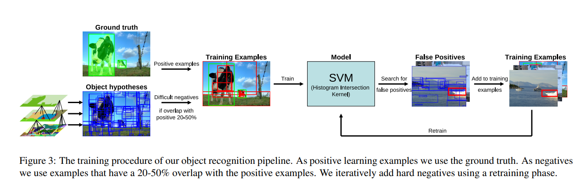

먼저 Ground truth window를 가진 Positive Example을 준비한다.  
SS를 통해 나온 물체가 존재하는 가설 영역 중에 Ground Truth와 Overlapping 되는 부분이 20 ~ 50% 정도 되는 영역을 Negative Example로 정한다.

    negative example이 중복되는 것을 방지하기 위해, negative example 끼리 70% 이상 겹치는 부분이 있다면 배제한다.

이 negative example들은 positive example들과 비슷해보이는 `구별이 어려운 example`이다.   
negative example들을 생성하는 이유는 Positive Example들과 feature vecter에서 그 유사도가 비슷하게 되고,  
결과적으로 SVM에서 Support vector가 될 가능성이 높기 때문이다. 즉, SVM이 결정 경계면을 학습하기 좋은 Sample들을 만들어 주는 과정인 것이다.

    또한 이 '구별이 어려운 example'들을 만들어 SVM을 학습시켰을 때, Hard Negative Sample에 대해서는 확실히 구별을 하는 모습을 보인다.

추가적으로 SVM에서 잘못 예측을 했다면, 해당 예측 결과를 학습 데이터에 추가해주어 학습 효율을 높인다. 

 

### Evaluation 

- Diversification Strategies
- Quality of Locations
- Object Recognition

---

- Diversification Strategies

1. Flat vs Hierarchical 

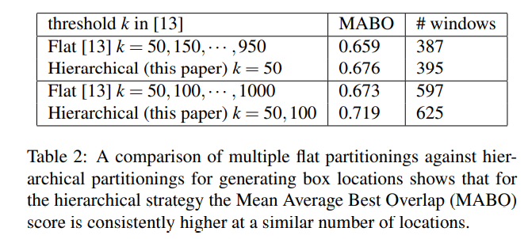

`MABO : Mean Average Best Overlap` 

2. Indivisual Diversification Strategies 

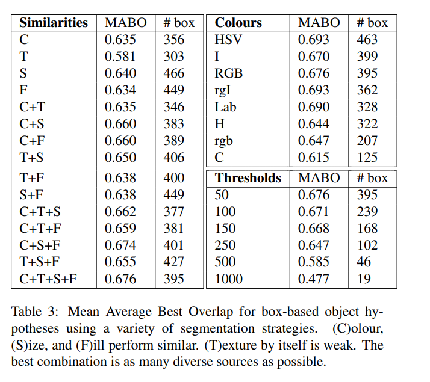

- Quality of Locations

1. Box Based Locations

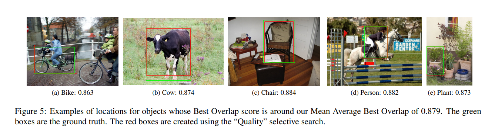

2. Region Based Locations

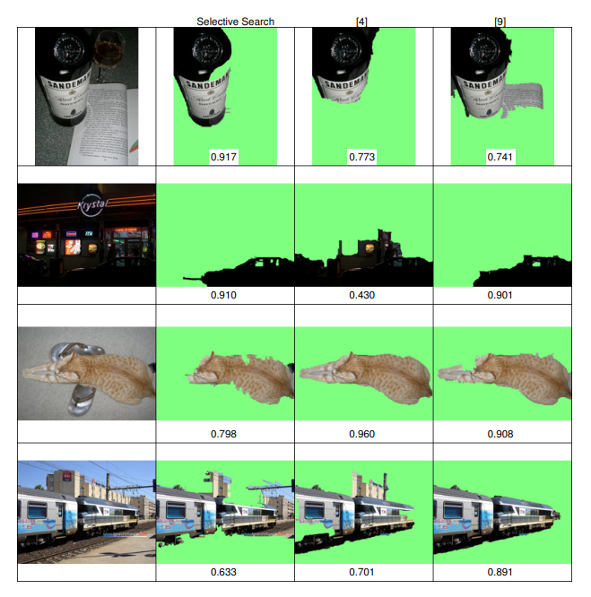

- Object Recognition 

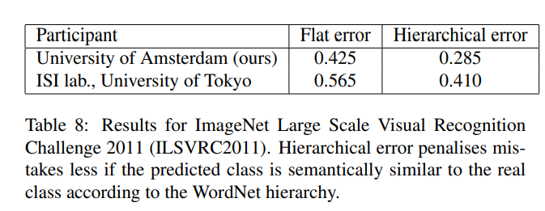

 

### Conclusion 

본 논문은 Segmentation을 사용한 선택적 region 탐색 방법을 제안한다.  
이미지는 내재적으로 계층적인 의미를 담고 있는 경우가 많고, 여러 가지 객체들이 하나의 객체를 형성하는 경우도 많다.  
따라서 단 하나의 bottom-up grouping 알고리즘은 절대 이러한 객체들의 location을 잘 잡아낼 수 없다.  
이를 해결하기 위해 우리가 제안한 SS는 다양한 기준으로 객체들이 존재할 수 있는 region들을 탐색하고, 이 결과들을 서로 상호보완하여    
객체들을 계층적으로 grouping하는 전략을 사용했다.   

