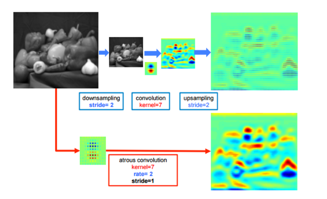
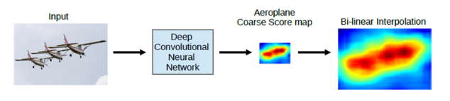
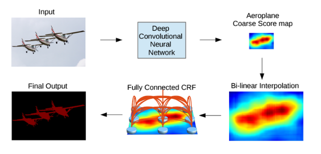
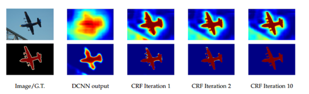
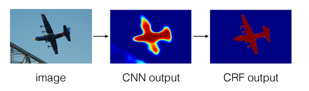
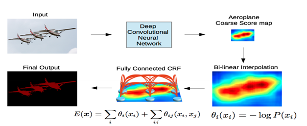

## DeepLab : Segmentation with Deep Convolution Nets, Atrous Convolution, and FUlly Connected CRFs

Deep Lab v2에 대한 논문 리뷰 

---

#### Before start 

DCNN과 Atrous Conv에 대한 이해도는 있으나, 아직 CRF에 대한 이해가 부족하다.

`CRF에 대한 선수지식은 다음과 같다.` 

    Naive Bayes - ok  
    HMM - ok 
    Maximum Likelihood Estimation 
    Lagrange Multiplier Method 
    Maximum Entropy Markov Model  
    Potential Function 

 

#### 기존 문제점

- Classifier기반 Network를 Semantic Segmentation에 적용할 때의 문제점

**Classification 또는 Detection은 이미지 내의 대상이 있냐 없냐에 집중한다.**

        따라서 강력한 성능을 보기위해서는 여러 단계의 Conv-pool 단계를 거쳐가며 
        영상 속에 계속 존재하며 변화에 영향을 받지 않는 Robust한 feature만을 끄집어내야한다.

반면에 Semantic Segmentation은 Pixel 단위의 Dense한 예측이 필요하다.  
만약 Classification 기반 Network를 사용하면 어떨까?

        Conv-pool의 영향으로 feature map이 계속 줄어들기에 detail한 정보와 Spatial한 정보를 잃게된다. 

 

#### What's done until now?

FCN 개발자는 Skip Connection을 이용해서 사라진 detail을 보강했다.
SegNet과 U-Net또한 Skip Connection과 Upsampling 을 통해 이 부분을 보강했다.

하지만 근본적으로 이미지의 Resolution이 나아지는 방법은 아니었다.

 

#### Deep Lab v2

`DeepLab v2는 기존 DeepLab v1에 ASPP 기법을 추가한 모델이다.`

- Atrous Convolution

`DeepLab`에서는 Upsampling과 Convolution 대신 Dilated Convolution을 사용한다.

`Dilated Convolution에 대한 설명은 해당 Directory review 참고하자.`

Dilated Conv(Atrous Conv)를 통해 Receptive Field를 늘리고, detail한 공간정보를 유지시킨다.

 

- `Atrous Conv + Bi-linear Interpolation`  

Deep Lab v2에서는 기존 DCNN 구조에서 pooling layer 2개를 제어하여 1/8크기의 feature map을 얻는다. 

Spatial 정보와 Resolution 복구의 이점 때문에 Pooling layer를 제거한 자리에 Atrous Conv를 추가한다.

        이를 통해 Receptive Field를 연산량의 증가 없이 넓힐 수 있다.
        결과적으로 Local Info 보다 Global Info에 더 집중할 수 있다.

이 후 Bilinear Interpolation을 이용해서 Upsample을 수행하여 원 영상 크기를 복원시킨다.

`입력` - `DCNN(with Atrous Conv)` - `1/8 feature map `- `BiLinear Interpolation` 

 

사실 애초에 모든 Layer에서 Atrous Conv 방법으로 Segmentation을 수행하면 된다.

하지만 어느정도 연산량을 줄여주긴 하지만 그래도 여전히 무겁기 때문에 적당한 선에서 타협을 본 것이다.

        위 그림에서 볼 수 있 듯, 적당히 Atrous Conv를 수행하고 나머지는 Interpolation으로 메꿔준다.

`But 여전히 Bi-Linear Interpolation만으로 정확히 객체의 Pixel단위까지 정교하게 Segmentation은 불가능했다!`

        이를 위해 뒷 부분은 CRF을 이용하여 post-processing을 수행한다.

 

#### Architecture Summary

결과적으로 전체적은 구조는 DCNN + CRF 의 형태이다.

        DCNN의 구조는 조금 더 세밀하게 Basic CNN + Atrous Conv + Bi-Linear Interpolation 구조이다.

        즉,  CNN + Atrous Conv + Bi-linear Interpolation + CRF 의 구조이다. 

 

- ASPP  (Atrous Spatial Pyramid Pooling)

`DeepLab v1`과 달리 `DeepLab v2`에서는 Multi-scale에 더 Robust하도록 ASPP기법을 사용한다.

        논문 저자들의 실험에 따르면 다음과 같다.

            단순히 rate = 12로 고정시키는 것보다 ASPP를 사용하는 것이 1.7%가량 성능이 향상되었다!

 

- Fully Connected CRF

앞의 것들만 사용하더라도 충분히 성능이 좋지만, 후처리로 CRF를 사용하면 매우매우 성능이 좋아진다!

일반적으로 1/8 크기의 feature map을 Bi-Linear Interpolation을 통해 원 크기로 복원하면 해상도가 그렇게 좋지는 못하다.

DeepLab 구조는 이 문제의 해결을 위해 CRF를 사용하여 후처리를 진행한다.

 

- CRF까지 추가된 동작 방식

1. DCNN을 통해 1/8 크기의 Coarse score map 획득
2. Bilinear interpolation으로 원 영상 크기로 복원  
3. (2)에서 얻어지는 결과는 각 픽셀 위치에서의 label에 대한 확률이다. - CRF의 unary term
4. 마지막으로 모든 픽셀 위치에서 Pairwise term 까지 고려한 CRF 후처리를 해준다.

