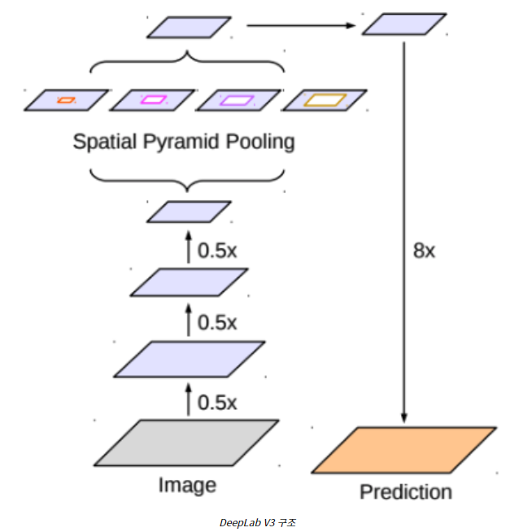
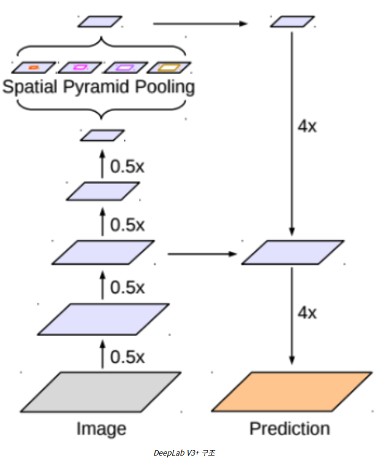
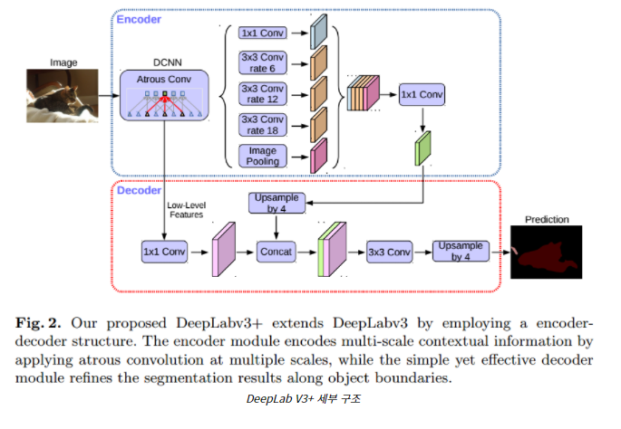

## `DeepLab v3+`

`DeepLab v3 , v3+는 v1, v2의 기법들을 Encoder-Decoder로 구조화시켰다.`

---

v3는 기본적으로 ResNet을 Backbone으로 사용하였고 구조는 다음과 같다. 

- Encoder : ResNet with Atrous Conv
- ASPP
- Decoder : Bilinear Interpolation + Fully Connected CRF

v3+ 가 변경된 부분은 다음과 같다. 

- Encoder : Xception with Atrous Conv
- ASSPP (Atrous Separable Spatial Pyramid Pooling)
- Decoder : Simplified UNET style Decoder로 변경 

세부 구조

 

v3+의 자세한 내용은 다음 링크를 참고하자.

[자세한 내용](https://wansook0316.github.io/ds/dl/2020/09/07/computer-vision-13-deep-lab.html)

