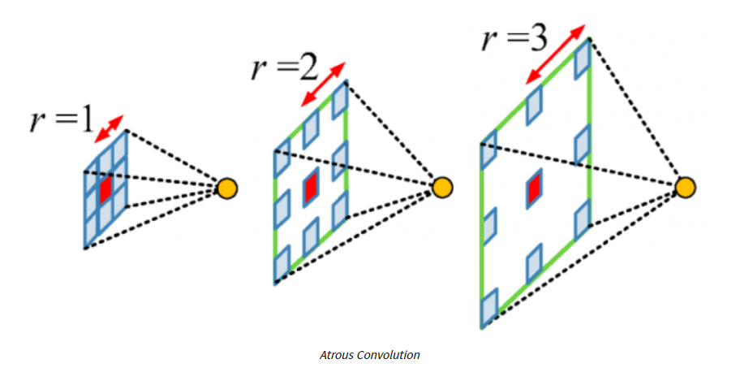
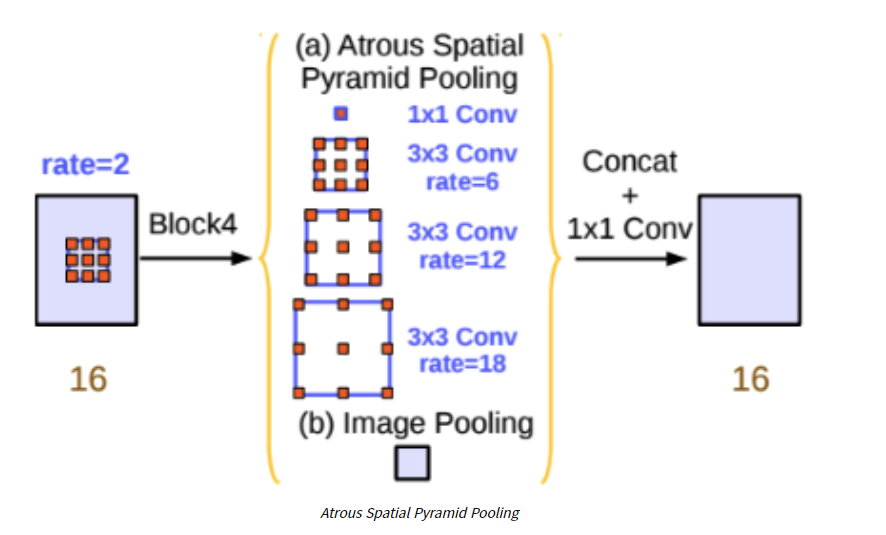
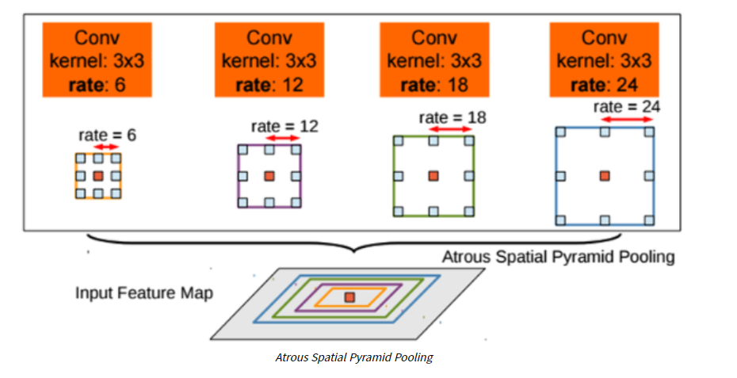
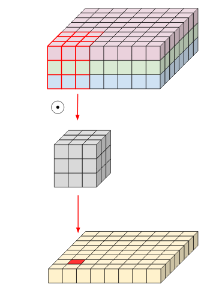
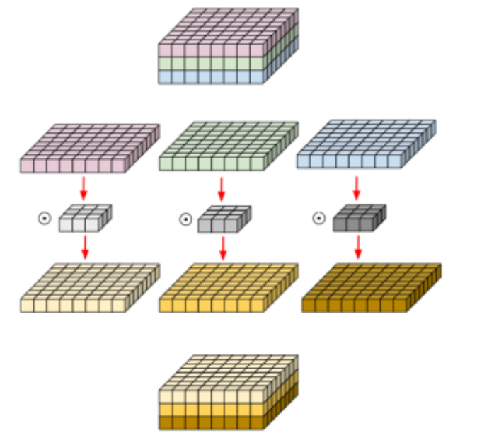
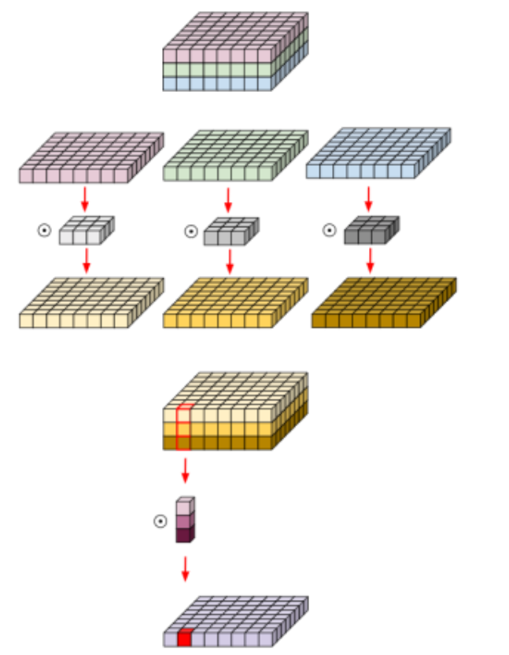
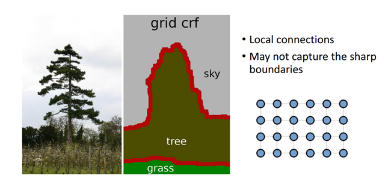
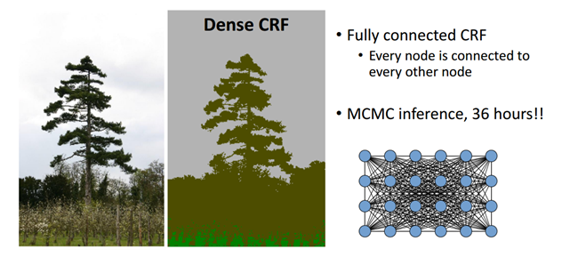

## `DeepLab v1 ~ v3+`

---

- 개요

`dilated Convolution(Atrous Conv)`을 적극적으로 활용해서 Segmentation을 해결해보자!

 

- 발전 방향

1. `DeepLab-v1`

        Segmentation에 Atrous Convolution을 처음 적용

2. `DeepLab-v2`

        Multi-Scale Context 적용을 위해 ASPP를 제안
        
            * Multi-Scale Context : 다양한 크기의 입력 영상
            * ASPP(Atrous Spatial Pyramid Pooling)

3. `DeepLab-v3`
    
        기존 ResNet CNN 구조에 Atrous Conv를 활용해 더 Dense한 feature map을 얻는 방법을 제안

4. `DeepLab-v3+`

        Atrous Seperable Convolution을 제안 
        기존의 구조를 Encoder - Decoder 구조로 변형
   
            Atrous Seperable Conv : DepthWise Seperable Conv + Atrous Conv

 

- 사용 개념

      1. Atrous Convolution  (dilated Convolution)
      2. ASPP (Atrous Spatial Pyramid Pooling)
      3. Depthwise Seperable Convolution
      4. Encoder - Decoder
      5. CRF

 

- Atrous Convolution

`더 자세한 내용은 Key-Notion의 dilated Conv참고` 

 

`Atrous`에서 trous는 구멍을 의미하며, Atrous Conv는 기존 Conv와 조금 다르다.

      Filter 내부에 빈 공간(0의 값)을 채운 채 Convolution을 진행한다!

`Atrous Conv`를 사용함으로써 얻을 수 있는 장점은 다음과 같다.

      기존 Conv와 동일한 Parameter 수를 유지하면서 receptive field를 크게 가져갈 수 있다.

 

- Atrous Spatial Pyramid Pooling (ASPP)

`DeepLab-v2`에서부터 `ASPP` 기법을 사용해서 Segmentation의 성능을 높였다.

`ASPP` : feature map으로부터 rate가 다른 Atrous Conv를 병렬로 적용한 뒤, 이를 다시 합쳐주는 기법  
`rate` : Atrous Conv의 팽창 정도 

Concat 후 1x1 Conv를 수행하는 이유는 Sparse한 출력 결과를 조금 더 Dense하게 만들기 위함이다.

      
 

- Basic Convolution

우선 `일반적인 Convolution`은 아래 그림과 같다.

입력이미지 : 8 x 8 x 8 , Filter   : 3 x 3 x 3

이 때, filter 1개가 가지는 파라미터 개수는 27(3x3x3)개 이다.

그리고 만약 filter의 개수가 4개라면 27 x 4인 108개 인 것이다.  

 

- Depthwise Convolution

아래 그림은 `DepthWise Separable Convolution`이다.

기존 Convolution 연산은 모든 채널을 filter가 Receptive 크기만큼 포함해서 계산했다.

`DepthWise Convolution`연산은 다음과 같다.

      채널을 모두 분리시킨 뒤, Channel axis 길이가 항상 1인 여러 개의 filter를 사용해서 Conv연산 수행

 

`Depthwise Conv` 과정을 자세히 살펴보면 다음과 같다.

      1. 입력 영상을 채널 기준으로 모두 분리한다.
      2. 채널 축 길이가 1인 Filter로 채널 마다 Convolution을 수행한다.
      3. 출력 결과를 채널 기준으로 다시 합친다.

 

- DepthWise Separable Convolution

다음으로`DepthWise Separable Convolution`이다.

위의 `DepthWise Convolution`의 결과에 채널 크기의 Conv filter를 적용한 것이다.

 

이처럼 복잡한 연산을 수행하는 이유 다음과 같다.

     1. 기존의 Conv와 유사한 성능을 보인다.
     2. Parameter 수와 연산량이 획기적으로 줄어든다.

      ex) filter 크기가 3x3x3이고, filter 개수가 16개 일 때의 파라미터 수 

            * (height x width x channel x num_filter)

         Convolution : 3 x 3 x 3 x 16 = 432 개 
         
         Depthwise   : ( 3 x 3 x 1 x 3 ) + ( 1 x 1 x 3 x 16 ) = 75 개 

 

#### 왜 파라미터가 줄어드는가?

`DepthWise Separable Convolution`은 기존의 Convolution filter가 `Spatial dimension`과 `Channel dimension`을 동시에 처리하던 것을 
분리해서 각각 처리한다고 볼 수 있다. 이 과정에서 여러 개의 filter가 `Spatial dimension` 처리에 필요한 파라미터를 공유하게 되서 총 파라미터 수를 줄일 수 있다는 것이다.

---

 

- CRF
        
`이전 Pixel 과의 관계(조건부 확률)를 기반으로 현재 Pixel 값을 추론`

 

CRF가 왜 필요한가?

    일반적으로 좁은 범위의 CRF (short-range crf)는 Segmentation을 수행한 뒤 생기는 Noise를 없애는 용도로 사용

DCNN에서는 여러 단계의 Conv+Pool를 거치며 feature map이 줄어든다.  
이를 Upsampling을 통해 원 영상 크기로 확대하므로 이미 충분히 Smoothing 되어 있다.

여기에 short-range CRF를 적용하면 오히려 더 나쁜 결과를 낸다. 

    Noise 성분도 같이 Upsampling되므로..

이에 대한 해결책으로 short-range CRF대신 전체 픽셀을 모두 연결한 `Fully connected CRF`를 사용한다.

`Fully connected CRF`가 놀라운 성능을 보였으므로, 이후 대부분의 모델에서 후처리로 이 기법을 사용한다. 

---

 

#### Short-range CRF

기존에 사용하던 Short-range CRF는 위 그림처럼 Local Connectrion 정보만 사용한다.

이렇게 되면 Detail한 정보가 누락된다.

 

#### Fully connected CRF

반면 Fully Connected CRF를 사용하면 아래와 같이 Detail한 정보들이 살아있는 결과를 얻는다.

대신 모든 Pixel을 서로 연결하여 처리하기 때문에 굉장히 오랜 시간이 걸린다.

MCMC : Markov Model Monte Carlo

 

`CRF는 확률론적인 기본 지식이 필요하므로, 추후 제대로 이해하며 업데이트하자!`

