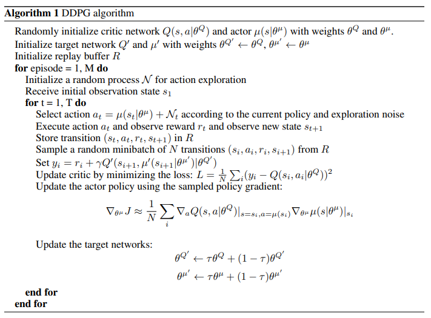

### DDPG (Deep Deterministic Policy Gradient) `2016 ICLR`

---

- `DDPG`

        DQN은 high dimensional state space의 문제들을 해결했지만, 여전히 discrete, low dimensional action space만을 다룰 수 있다.

                      * DQN   -> Continuous state, discrete action 다룰 수 있다. (SPG + Non-Linear FA - Neural Netowork)
                        Q learning 기반
                        TD + Non-Linear Function Approximation + Soft greedy + Target Network + Replay Buffer

                      * DPG   -> Continuous state, continuous action 다룰 수 있다. (DPG + Linear FA)
                        Actor Critic 기반 (On-Policy Actor-Critic / Off-Policy Actor-Critic 제안) 
                                -> convergence issue 해결 (Compatible FA, Gradient TD)
                        TD + Linear Function Approximation + DPG

                      * DDPG  -> Continuous state, continuous action 다룰 수 있다. (DPG + Non-Linear FA - Neural Netowork)
                        Actor Critic 기반 (Off-Policy Actor-Critic 제안)
                                -> Convergence 보장 X 
                        TD + Non-Linear Function Approximation + DPG + Batch Normalization + Target Network + Replay Buffer + Soft update 

        * DDPG        
        
            - Actor  : DPG
            - Critic : Non-Linear FA (Neural Network) - TD update 
            - Replay buffer (off policy)
            - Target Network (Double sampling issue, smoothness issue -> stablize)
            - Soft update (Improve stablity more than just full target network update)
            - Batch Normalization (Improve stablity with removing inner covariance shift)
            - Ornstein-Uhlenbeck noise for exploration

        * DQN, DDPG -> Can train with raw sensory input !! (Ex. Train robotics with raw image input)
        
        
---

- `Discretization of Action Space`

        DQN은 Q learning의 max operation으로 인해, continuous action space에 적용하기 어렵다. 
        어떻게든 Continuous action을 DQN으로 해결해보는 방법 중에 좀 쉬워보이는 방법은 Continuous action을 discretize하는 것 
        
            -> curse of dimension에 걸리기 딱 좋다.
            -> 중요한 정보를 많이 버리기 때문에 좋지 않다.  

---

- `Convergence of non-linear function approximation`
  
  
        Non-Linear function approximator를 쓰는 건 더이상 Convergence를 보장할 수 없다는 걸 의미한다.
          ex) Neural network
    
        하지만 그럼에도 large state, action space에서 학습을 수행하기 위해서는 이러한 방법의 도입이 너무너무 필요하다.  

---

- `Target Update & Soft Target Update`

        *DQN

        target newtork 없이 Q function approximator를 업데이트 할 경우, 

            J = E[ (R + rQ(s', a') - Q(s, a))**2 ]

        업데이트 되는 Q network가 target value인 Q(s', a')를 계산하는 데에도 사용되기 때문에 Q 값이 diverge하는 일이 생긴다. 
        따라서 DQN에서는 target network를 만들어서 학습을 조금 더 stable하게 만들었었다.

 

        * DDPG

        DQN에서는 주기적으로 train network의 파라미터를 target network로 복사했다.
        반면, DDPG에서는 target network를 조금 더 soft 하게 업데이트 한다.
      
        이것은 target value가 조금 더 천천히 변하게 하는 제한 조건이 되고, 학습 안정성에 아주 크게 기여하는 결과를 가져온다. 

        또한 안정된 target value를 위해서는 critic(Q)와 actor(π) 모두 target network를 만들어야한다. 
        이렇게 되면 divergence없이 critic을 일관되게 학습시킬 수 있다.  
        
        학습 속도면에서는 느려지지만, 안정성 면에서는 매우 좋아졌다. 

---

