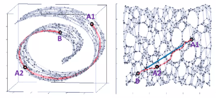

### Natural policy gradient

- gradient update with first-order approx. in Riemannian manifold / Riemannian space   

---

- `reference`

        Natural gradient method는 리만 매니폴드 공간에서의 steepest descent direction을 강조한다.
        
            리만 매니폴드 : 각지지 않고 미분가능하게 매끄러운 곡률을 가진 면 (미분 가능한 부드러운 매니폴드)

        즉, 리만 공간에서의 일차 미분을 이용한 policy gradient update가 주요 Topic

            (유클리드 공간의 이차 미분 = 리만 공간의 일차 미분)

    
        논문에서는 natural gradient가 더 좋은 action을 취하기보다 최적의 action을 취하는 방향으로 움직인다고 한다. 
    

        매니폴드를 고려하지 않고, B - A1 & B - A2 간 거리를 비교해보자.
        
        유클리드 공간에서는 B - A1 거리가 더 가깝다.
        하지만 매니폴드 공간에서는 B -> A1 보다 B -> A2가 더 가깝게 위치한다.

        1. Policy(B)에서 policy gradient를 통해 1 step 움직인 것이 A1이라면 너무 크게 움직인 것일 수 있다.
        그래서 이를 보완하기 위해 매우 작은 크기의 step size (0.0001) 을 곱해 조금씩 변하게 했다.
        
        2. Policy(B)에서 policy gradient를 통해 1 step 움직여 A2로 갔다면 Policy가 보다 더 유의미하게 움직인 것이라고 볼 수 있다.

        B -> A1 보다 B -> A2가 조금 더 covriant 하다고 한다. 

        즉, policy 를 유클리드 공간에서 해석하지 말고, 리만 매니폴드에서 해석하면 조금 더 정확하게 gradient update를 할 수 있지 않을까?

        So.. natural gradient에서는 policy가 리만 매니폴드를 따른다는 가정을 한다.