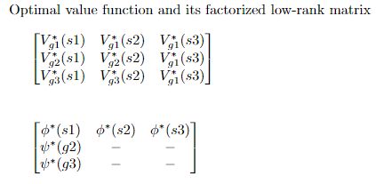
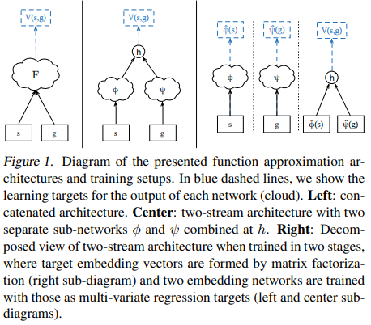

### UVFA `2015 ICML`

---
- `topics`

        1. UVFA concept
        2. UVFA learning architecture 
        3. UVFA in supervised learning setting
        4. UVFA in reinforcement learning setting 
            - Generalizing from Horde / Direct bootstraping
        5. Future application 

---
- `UVFA concept`

        일반적으로 value function(or approximator)은 현재 state에서의 expected return. (= V(s;θ)) 
        UVFA는 state 뿐만 아니라, goal도 같이 고려한 expected return을 제시한다. (= V(s,g;θ))

            -> 전에도 goal을 같이 고려한 Horde architecture, universal function 같은게 있긴 있었단다.

        이 UVFA를 통해, 모든 goal에 대해서 value function을 학습할 수 있다.

            i.e) set of goal = {toilet, bedroom, livingroom} 일 때,

                V(my_room, toilet; θ)     : goal = toilet이고, 현재 my_room 있을 때의 expected return  
                V(my_room, bedroom; θ)    : goal = bedtroom이고, 현재 my_room 있을 때의 expected return
                V(my_room, livingroom; θ) : goal = livingroom이고, 현재 my_room 있을 때의 expected return

            를 single stream으로 한 번에 학습할 수 있다는 얘기 -> 솔직히 이게 되나 했는데 역시나 믓찐 Tom 행님 
       
  
        UVFA에서는 data를 sparse matrix로 다룬다. -> learning architecture 보면 이해됨

            sparse matrix의 행 : observed states 
            sparse matrix의 열 : goals
    
        이 sparse matrix를 low-rank matrix로 분해한다. (SVD처럼)
    
            low-rank로 분해된 이후의 matrix의 행 : ϕ*(s)
            low-rank로 분해된 이후의 matrix의 열 : ψ*(g)

        이제 우리는 regrssion으로 이 ϕ*(s) / ψ*(g)를 잘 근사하는 ϕ(s) / ψ(g) 를 찾는다.. How? 

            state -> ϕ(s) / goal -> ψ(g) 로의 non-linear mapping을 학습할 것 (Neural network)   

        여기서 말하는 sparse matrix의 원소들은 true target value (optimal value function)
        low-rank matrix 원소들도 true target value (optimal value)

            근데 그냥 low-rank로 분해하지 말고 sparse matrix 그대로 regression 하면 되지 않나?
                -> low-rank로 변환해도 잡아낼 정보는 다 잡아내고, regression이 훨씬 빠르단다. 
                   (여기 실험에선 dim = 7이면 충분하댔음.)

        다시 말하지만, UVFA의 concept은 state, goal 모두를 아우르는 sparse matrix 내의 많은 optimal value 들을 
        single, unified function approximator로 해결한다는 것 
        

---
- `Horde architecture`

        Paper에서 비교하는 Horde method에 대해 간단히.

        Ex) 4x4 tabular case. 

        Horde architecture는 4x4 16개의 격자를 각각 goal로 하는 16개의 demon을 생성한다. 
        이제 각자의 goal state를 가진 16개의 demon이 각자 value function을 학습한다. 

            -> This is Horde architecture 
---

- `UVFA learning architecture`

        3가지 구조가 있고 paper에서는 3번째 구조 선택 . 

        # two stage - two stream :
                1. state -> ϕ(s) <-> ϕ'(s) / goal -> ψ(g) <-> ψ'(g) 의 non-linear mapping 학습 with regression 
                2. ϕ'(s) / ψ'(g)의 함수 h 와 target sparse matrix의 non-linear mapping 학습 with regression 

---

- `UVFA in supervised learning setting`

