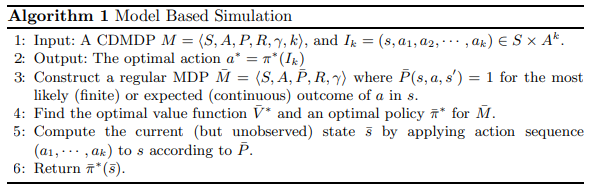
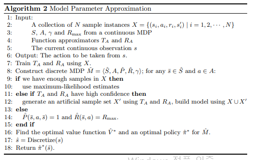

#### Delayed Feedback `2008`

Learning and planning in env with delayed feedback

  -> MPA part rework  

---

- `summary`

      This paper is for constant observation / reward delay
      
      1. Memoryless approach is still works at a small k.
      2. Augmented approach alone is NP-Hard. (Here called Compact Augment)
      3. Augmented approach for 4 special case can overcome some limitations.
          -> Propose MBS / MAP method

---

- `Delay feedback`

        About constant observation delay / reward delay

        Augmented approach는 exponential state space expansion으로 이어질 수 있어 적합하지 않다. (NP-Hard)
        So, general delayed MDP에서의 planning 문제에는 좋지 않은 결과를 준다.

        But 아래 4가지 특별한 case에서는 그래도 괜찮다. 

        1. Finite discrete   MDP + deterministic     => P(s, a, s') = 1
        2. Finite continuous MDP + deterministic     => P(s, a, s') = 1 
        3. Finite discrete   MDP + Mildly stochastic => P(s, a, s') = 1 - δ, (δ > 0) 
        4. Finite continuous MDP + bounded noise wt  => perturbed state transition

---

- `CDMDP`

        CDMDP <S, A, P, R, γ, k > policy is defines as below:

            π : (S x A_k) -> A        

        #CDMDP planning problem : 

            given a CDMDP, initial state I_k, and a reward threshold θ,

              -> determine whether a policy exist that achieves an return of at least θ.

        #CDMDP learning problem :

            S, A, γ만 알고 있는 agent가 delayed 환경에서 optimal policy 찾기. 

---

- `delay 처리 전략`

    
        #1. General planning method
    
            1) Wait agent :
    
                k step을 기다리고 undelayed MDP에서 처럼 optimal action을 고르는 것. 
                  -> mountain car 문제처럼 waiting을 용납하지 못하는 문제에는 적용 x
                  -> 주로 sub-optimal
    
            2) CDMDP를 MDP처럼 보기 (memoryless method = deterministic policy)
    
                몇몇 환경에서는 꽤 괜찮은 policy를 얻을 수 있다. (특히, k가 state transition의 크기에 비해 상대적으로 작을 때) 
    
                CDMDP learning 문제에서, eligibility trace is works well. (= Sarsa(λ))
    
    
            3) Augmented method 
    
                Construct an MDP equivalent to the original CDMDP in the much larger state space SxA_k
                Corresponding optimal policy is known to be an optimal policy for CDMDP!
    
                  Unfortunately, this expansion makes MDP planning algorithm intractable for large k. 
                      -> paper에서는 k=5 이상부터 intractable한 것으로..
     
    
        #2. Proposed method - Augmented method for 4 special cases 
    
            이 논문에서는 k에 따라 state space가 커지는 건 피할 수 없지만,
            이 computational burden을 우회하고 최적 or 근최적해를 얻을 수 있는 4가지 special case를 제안한다. 
    
    
        Experiments에서는 Memoryless methodd와 MBS+MPA를 비교 (K가 상대적으로 크지 않을 때에는 Memoryless method도 나쁘지는 않다.) 

---

- `Model Based Simulation (MBS) for planning in delayed env`

            #MBS to planning 

                planning에서 다음 state를 찾고, reward를 모으는 등의 방법은 
                내가 쉽게 이해한 그 방법이다.

                1. 주어진 S, A, P, R, gamma로 MDP를 구성한다. <S, A, P, R, gamma>
                2. MDP에 대해 optimal V, policy를 찾는다. (ex. dynamic programming)
                3. I = (s5, a1, a2, a3, a4)가 주어졌을 때, s5에서 a1, a2, a3, a4에 대한 Q 값을 계산한다.
                4. 이 중 optimal한 선택을 한다. 
          

            #extend MBS to learning

                discrete state, action space에서는 큰 문제없이 사용할 수 있다.  (case1, case3)

                    under zero-dealy MDP에서 model-base RL 알고리즘 사용하면 된다.

                continuous state, action space에서는 추가적으로 좀 만져줘야한다. (case2, case4)

                    단순히 environment를 discritize하는 건 충분하지 않다. 
                    deterministic or perturbed state transition을 far less benign dynamics로 바꾸면?
                    즉, 연속 -> 이산으로 행동이 크게크게 바뀌면?

                        ->   action simulation이 말도 안될 수도 있다.

---

- `Model Parameter Approximation (MPA)`

        MPA는 zero-delay MDP에 사용되는 model-base 알고리즘인데, planning 부분이 simulation이 없는 MBS와 거의 비슷하다.

            -> bounded, continuous state, action space MDP에서 사용할 수 있는 Model-based algorithm
            -> Lazy Learning과 깊게 관련

        So, Continuous CDMDP learning에서 MPA를 사용하려면, 
        MPA의 transition function approximator T를 이용해서 현재 state를 discretize하기 전에 MBS의 simulation을 수행한다.

--- 

- `Memoryless vs Augmented with MBS / MPA`

        Memoryless :

                Learns fast, and gives reasonable result for small k
                But gives sub-optimal and hard to use for large k

        Augmented with MBS / MBS + MPA:

                slow to learn from the finite samples available

            