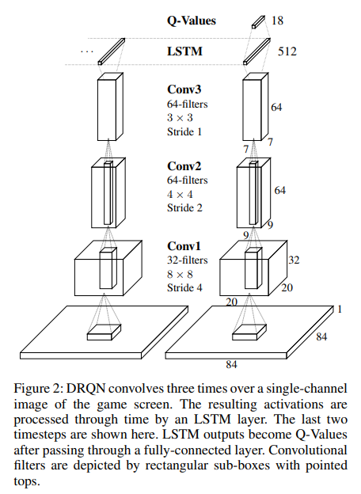

### Deep Recurrent Q-Network for POMDP `2015 AAAI`  

---

- `POMDP`

    풀고자 하는 문제가 MDP로 잘 정의된다면 좋겠지만, 실제로는 fully observable한 case는 드물다.
    
        ex) robotics의 경우 environemt를 senser data 만으로 인지해야한다. (Partially observable)

    MDP := <S, A, P, R>

    POMDP := <S, A, P, R, O, Ω> 

        Ω : observation 
        O : observation이 관측될 확률 
        
        즉, 관측치 o는 분포 O에 따라 sampling ( o ~ O(s) , o ∈ Ω )

    일반적으로 partially observable 에서는 Q 값을 추정하기가 매우 어렵다.

        Q(s, a; θ) != Q(o, a;θ)

    이 DRQN 논문은 위 수식 간 gap을 줄이려는 시도를 했다고 생각하고 읽기 시작하면 될 것 같다. 

---

- `DRQN`

        기존 DQN은 네트워크 입력으로 4개의 이미지를 묶어서 넣어줬다.
        DRQN은 1개 이미지만 넣어주어도 DQN과 같은 성능을 낸다.

        더군다나 POMDP 환경에서도 DQN보다 성능 저하가 훨씬 덜하다.

            MDP 환경에서 학습 -> MDP 환경에서 평가   : DQN DRQN 모두 당연히 잘된다.
            MDP 환경에서 학습 -> POMDP 환경에서 평가 : DQN보다 DRQN 성능저하가 훨씬 적다.

        DRQN은 DQN의 첫 fc layer를 LSTM으로 대체한 구조를 갖는다.
        
        모델 학습 데이터는 두 가지 방법으로 넣어줄 수 있다.

        1. Bootstrapped Sequential Updates

            1) Replay buffer에서 random하게 episode를 꺼낸다.
            2) Update가 episode 처음부터 time step에 따라 episode 끝까지 진행된다.

                lstm hidden unit의 초기값은 이전 time step에서 forwarding

                Initial hidden unit 값이 forwarding된 것을 사용하기 때문에 학습이 좋다. 
                But, random sampling policy를 위반

        2. Bootstrapped Random Updates

            1) Replay buffer에서 random하게 episode를 꺼낸다.
            2) episode 내의 random point에서 시작해서 target network가 update 되기 전까지의 time step만큼 업데이트 진행
            
                lstm hidden unit의 초기값은 0

                Random sampling policy를 위반하지는 않는다.
                But initial hidden unit 값이 0으로 초기화되기 때문에 학습이 조금 더 어렵다.

