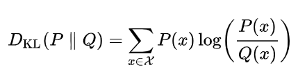
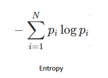
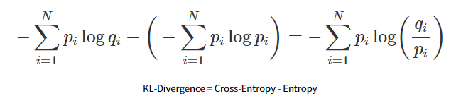
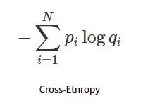
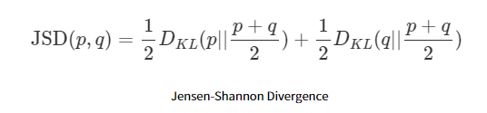

### KL - Divergence

[참고블로그](https://hwiyong.tistory.com/408)

`결론`

    실제 확률 분포의 정보량과 학습을 통해 점점 근사되는 확률 분포의 정보량이 비슷해질수록 KLD의 값이 낮아진다.
    즉, 두 분포가 유사해진다는 것을 의미한다.

    정보량 == 평균

 

`설명`

KLD는 y_true(P)와 y_pred(Q)가 가지는 분포값이 얼마나 다른지 측정하는 방법이다.

KLD 값이 낮을 수록 두 분포가 비슷하다고 해석한다.

    우리가 많이 사용하는 Cross Entropy가 바로 KLD에서 온 것이다! 

`Q : 사전 분포`
`P : 사후 분포`

정보이론에서는 정보량을 효과적으로 표현하기 위해 log를 사용한다.

- 확률이 높을수록 : 매우매우 당연하게 일어날 사건 (1에 가까운 확률) 
- 확률이 낮을수록 : 자주 일어나지 않는 특별한 사건 (매우매우 작은 확률)

 

우리가 흔히 보는 `Entropy는 평균 정보량`을 나타낸다.

즉, Sum (해당 값 x 해당 값이 나올 확률)이다. 

    이는 discrete R.V의 평균 (기댓값)임을 기억하자.

 

#### KLD와 Cross Entropy

KLD에는 Cross Entropy 식이 포함되어 있다.

- p : 실제 확률분포 P
- q : 모델이 예측한 확률분포 --- 확률분포 P로 근사될 분포 Q

`KLD = CE - Entropy`

 

`CE` 와 `Entropy`

 __  

**실제 확률 분포의 정보량과 (평균) 학습을 통해 점점 근사되는 확률 분포의 정보량이 비슷해질수록 좌변이 0에 가까워진다.**
**즉, KLD의 값이 낮아지며 두 분포가 유사해진다는 것을 의미한다.**

#### 모델 학습에서의 KLD

보통 자주 쓰는 BCE 또는 CE는 KLD를 쓰는 것과 사실 동일하다.

Entropy에 해당하는 Term은 사실상 고정값이기 때문에 loss 최소화에 영향을 주지 않는다.

따라서 생략 가능하다.

우리가 모델을 학습시키며 최소화할 부분은 근사되는 분포인 CE term이기 때문이다.

 

#### GAN에서의 KLD

하지만 GAN에서는 진짜 분포의 정보량도 매우매우 중요하다.

따라서 이를 활용한다. 

KLD를 그대로 사용하지 않고 이를 거리 개념으로 해석할 수 있게 바꾼 Jensen-Shannon Divergence를 사용한다. 

